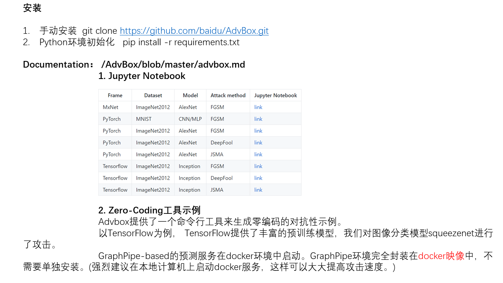

# AdvBox

## Content

- [AdvBox官方Turorial](#AdvBox-English)
- [百度安全研究员假脸检测研究](#百度安全研究员假脸检测研究)
- [AdvBox使用](#AdvBox使用)


### 1. AdvBox官方Turorial <span id = "AdvBox-English">

#### Advbox Family


Advbox Family is a series of AI model security tools set of Baidu Open Source,including the <font color=800080>**generation, detection and protection of adversarial examples**</font>, as well as attack and defense cases for different AI applications.

###### Our Work

- [COMMSEC: Tracking Fake News Based On Deep Learning. HITB GSEC 2019](https://gsec.hitb.org/sg2019/sessions/commsec-tracking-fake-news-based-on-deep-learning/)
- [COMMSEC: Hacking Object Detectors Is Just Like Training Neural Networks. HITB GSEC 2019](https://gsec.hitb.org/sg2019/sessions/commsec-hacking-object-detectors-is-just-like-training-neural-networks/)
- [COMMSEC:<font color=800080> **How to Detect Fake Faces (Manipulated Images) Using CNNs. HITB GSEC 2019**</font>](https://gsec.hitb.org/sg2019/sessions/commsec-how-to-detect-fake-faces-manipulated-images-using-cnns/) [点此了解](https://anquan.baidu.com/article/981)
- [Transferability of Adversarial Examples to Attack Cloud-based Image Classifier Service. Defcon China 2019](https://www.defcon.org/html/dc-china-1/dc-cn-1-speakers.html)
- [<font color=800080> **Face Swapping Video Detection with CNN**</font>. Defcon China 2019](https://www.defcon.org/html/dc-china-1/dc-cn-1-speakers.html)

 

##### AdvSDK

A Lightweight Adv SDK For PaddlePaddle to <font color=800080> **generate adversarial examples**</font>.

[Homepage of AdvSDK](advsdk/README.md) 

##### AdvBox

Advbox is a toolbox to <font color=800080> **generate adversarial examples**</font> that fool neural networks in PaddlePaddle、PyTorch、Caffe2、MxNet、Keras、TensorFlow and Advbox can benchmark the robustness of machine learning models. Advbox give a command line tool to generate adversarial examples with Zero-Coding.

[Homepage of AdvBox](https://github.com/advboxes/AdvBox/blob/master/advbox.md)

##### ODD(Object Detector Deception)

ODD is a tool-box for attacking object detectors with mainstream attack methods. It provides users with convenience on doing experiment and benchmark. Users can place modified OD model and customize attack cost function according to attack goal in the framework.

For now, ODD only has a yolo(faster-yolo v2) model to play with. We welcome contributions for more models and attack methods to go onto the stage.

- It is Open Source for [COMMSEC: Hacking Object Detectors Is Just Like Training Neural Networks. HITB GSEC 2019](https://gsec.hitb.org/sg2019/sessions/commsec-hacking-object-detectors-is-just-like-training-neural-networks/)
- [Recorded Video from 6:00:00](https://www.youtube.com/watch?v=MGc_KskTnF4)

[Homepage of ODD](advbox_family/ODD/README.md)

##### AdvDetect

AdvDetect is a toolbox to detect adversarial examples from massive data.

[Homepage of AdvDetect](advbox_family/AdvDetect/README.md)

##### AdvPoison

Data poisoning

#### AI applications

##### Face Recogniztion Attack

[Homepage of Face Recogniztion Attack](applications/face_recognition_attack/README.md)

#### Stealth T-shirt

On defcon, we demonstrated T-shirts that can disappear under smart cameras. Under this sub-project, we open-source the programs and deployment methods of smart cameras for demonstration.

[Homepage of Stealth T-shirt](applications/StealthTshirt/README.md)


##### Fake Face Detect

The restful API is used to detect whether the face in the picture/video is a false face.

[Homepage of Fake Face Detect](applications/fake_face_detect/README.md)


##### Paper and ppt of Advbox Family

##### Issues report

[https://github.com/baidu/AdvBox/issues](https://github.com/baidu/AdvBox/issues)

##### License

AdvBox support [Apache License 2.0](https://github.com/baidu/AdvBox/blob/master/LICENSE)

##### Authors

- Baidu xlab

##### How to Cite

If you instead use AdvBox in an academic publication, cite as:

```
@misc{advbox,
 author= {Baidu X-lab},
 title = {Advbox:a toolbox to generate adversarial examples that fool neural networks},
 month = mar,
 year  = 2019,
 url   = {https://github.com/baidu/AdvBox}
}
```


### 2. 百度安全研究员假脸检测研究 <span id = "百度安全研究员假脸检测研究">


### 3. AdvBox使用 <span id = "AdvBox使用">





