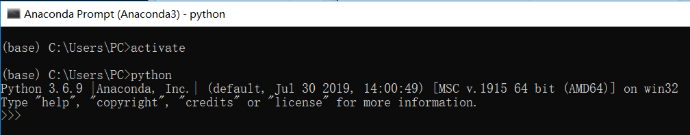
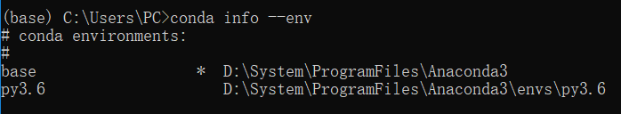

# Anaconda-Tutorial

## Content

- [下载和安装](https://blog.csdn.net/ITLearnHall/article/details/81708148)
- [配置环境变量](https://jingyan.baidu.com/article/47a29f24610740c0142399ea.html)
- [管理虚拟环境](#管理虚拟环境)


## 管理虚拟环境

- [进入虚拟环境](#进入虚拟环境)

1. 打开命令行

2. 进入anaconda设定的虚拟环境 <span id = "进入虚拟环境">

   activate 能将我们引入anaconda设定的虚拟环境中, 如果你后面什么参数都不加那么会进入anaconda自带的base环境。

   你可以输入python试试, 这样会进入base环境的python解释器, 如果你把原来环境中的python环境去除掉会更能体会到, 这个时候在命令行中使用的已经不是你原来的python而是base环境下的python.而命令行前面也会多一个(base) 说明当前我们处于的是base环境下。

   ```bash
   activate
   ```

   

3. 查看Ananconda的虚拟环境

   ```bash
   conda info --env % 查看所有环境，前面有个‘*’的代表当前环境
   ```

   

4. 创建自己的虚拟环境

   - 安装虚拟环境(virtual environment)的好处：

     通俗的来讲，虚拟环境就是借助虚拟机docker来把一部分内容独立出来，我们把这部分独立出来的东西称作“容器”，在这个容器中，我们可以只安装我们需要的依赖包，各个容器之间互相隔离，互不影响。

   - 为什么要安装虚拟环境：

     在实际项目开发中，我们通常会根据自己的需求去下载各种相应的框架库，如tensorflow、dlib等，但是可能每个项目使用的框架库并不一样，或使用框架的版本不一样，这样需要我们根据需求不断的更新或卸载相应的库。直接怼我们的Python环境操作会让我们的开发环境和项目造成很多不必要的麻烦，管理也相当混乱。

   - 举例：

     项目A需要某个框架1.0版本，项目B需要这个库的2.0版本。如果没有安装虚拟环境，那么当你使用这两个项目时，你就需要 **来回** 的卸载安装。

     公司之前的项目需要python2.7环境下运行，而你接手的项目需要在python3环境中运行，如果不使用虚拟环境，这这两个项目可能无法同时使用，使用python3则公司之前的项目可能无法运行，反正则新项目运行有麻烦。而如果虚拟环境可以分别为这两个项目配置不同的运行环境，这样两个项目就可以同时运行。

   - 我们当然不满足一个base环境, 我们应该<font color=800080>为自己的程序安装单独的虚拟环境</font>。

     创建一个名称为python37的虚拟环境并指定python版本为3.7(这里conda会自动找3.7中最新的版本下载)

     ```bash
     conda  create -n python37  python=3.7
     ```

     

   - 

5. s

6. s


