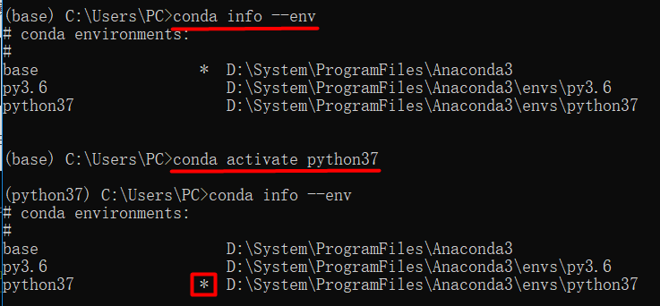
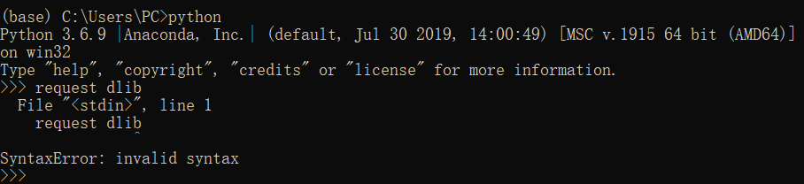
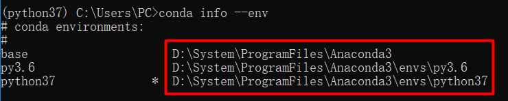
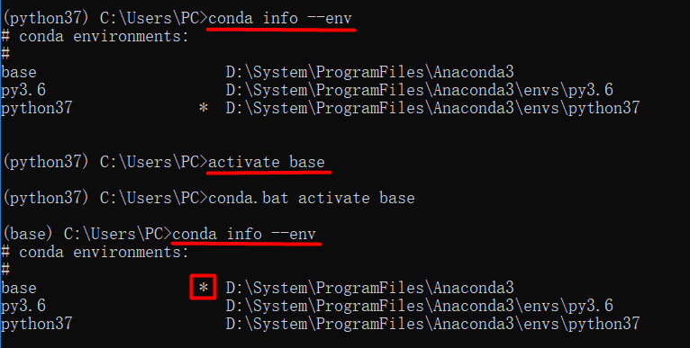
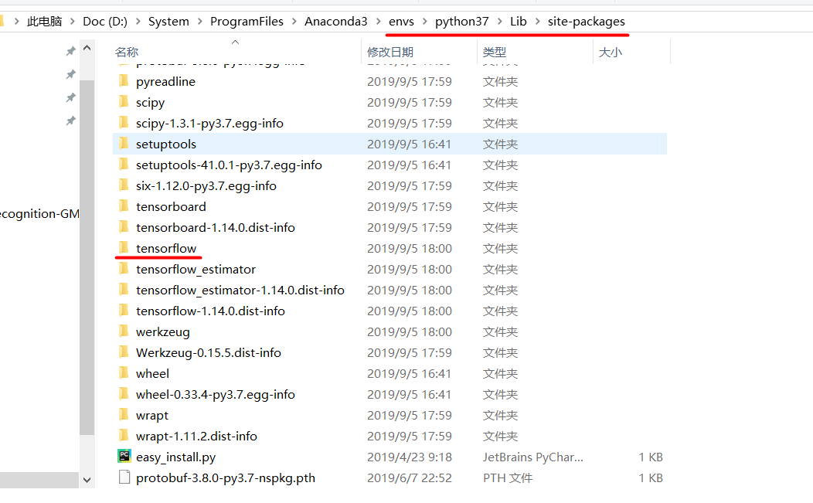

# Anaconda-Tutorial

## Content

- [下载和安装](https://blog.csdn.net/ITLearnHall/article/details/81708148)
- [配置环境变量](https://jingyan.baidu.com/article/47a29f24610740c0142399ea.html)
- [管理虚拟环境](#管理虚拟环境)
- [安装使用tensorflow](#安装使用tensorflow)


## 管理虚拟环境

- [进入虚拟环境](#进入虚拟环境)
- [查看有哪些虚拟环境](#查看有哪些虚拟环境)
- [创建虚拟环境](#创建虚拟环境)
- [使用新的虚拟环境](#使用新的虚拟环境)
- [虚拟环境的物理路径](#虚拟环境的物理路径)
- [切换虚拟环境](#切换虚拟环境)
- [导出虚拟环境配置](#导出虚拟环境配置)
- [删除虚拟环境](#删除虚拟环境)

1. 打开命令行

2. 进入anaconda设定的虚拟环境 <span id = "进入虚拟环境">

   activate 能将我们引入anaconda设定的虚拟环境中, 如果你后面什么参数都不加那么会进入anaconda自带的base环境。

   你可以输入python试试, 这样会进入base环境的python解释器, 如果你把原来环境中的python环境去除掉会更能体会到, 这个时候在命令行中使用的已经不是你原来的python而是base环境下的python.而命令行前面也会多一个(base) 说明当前我们处于的是base环境下。

   ```bash
   activate
   ```

   

3. 查看Ananconda的虚拟环境 <span id = "查看有哪些虚拟环境">

   ```bash
   conda info --env % 查看所有环境，前面有个‘*’的代表当前环境
   conda env list % 二者均可
   ```

   

4. 创建自己的虚拟环境 <span id = "创建虚拟环境">

   - 安装虚拟环境(virtual environment)的好处：

     通俗的来讲，虚拟环境就是借助虚拟机docker来把一部分内容独立出来，我们把这部分独立出来的东西称作“容器”，在这个容器中，我们可以只安装我们需要的依赖包，各个容器之间互相隔离，互不影响。

   - 为什么要安装虚拟环境：

     在实际项目开发中，我们通常会根据自己的需求去下载各种相应的框架库，如tensorflow、dlib等，但是可能每个项目使用的框架库并不一样，或使用框架的版本不一样，这样需要我们根据需求不断的更新或卸载相应的库。直接怼我们的Python环境操作会让我们的开发环境和项目造成很多不必要的麻烦，管理也相当混乱。

   - 举例：

     项目A需要某个框架1.0版本，项目B需要这个库的2.0版本。如果没有安装虚拟环境，那么当你使用这两个项目时，你就需要 **来回** 的卸载安装。

     公司之前的项目需要python2.7环境下运行，而你接手的项目需要在python3环境中运行，如果不使用虚拟环境，这这两个项目可能无法同时使用，使用python3则公司之前的项目可能无法运行，反正则新项目运行有麻烦。而如果虚拟环境可以分别为这两个项目配置不同的运行环境，这样两个项目就可以同时运行。

   - 我们当然不满足一个base环境, 我们应该<font color=800080>为自己的程序安装单独的虚拟环境</font>。

     创建一个名称为python37的虚拟环境并指定python版本为3.7(这里conda会自动找3.7中最新的版本下载)

     ```bash
     conda  create -n python37  python=3.7 % -n就是-name的缩写，所以用-name也是一样的
     ```

5. 使用新的虚拟环境 <span id = "使用新的虚拟环境">

   - 激活新创建的虚拟环境：

     ```bash
     conda activate python37
     ```

     

   - 查看当前环境有没有安装包：

     ```bash
     python % 进入python解释器
     import dlib % 如果有报错说明没有安装此包
     ```

     

   - 为新创建的虚拟环境安装第三方包：

     ```bash
     pip install numpy
     conda install numpy % 会同时安装很多相关的包
     ```

   - 检查包有没有安装上：

     ```bash
     python % 进入python解释器
     import dlib % 如果有报错说明没有安装此包
     ```

   - 卸载第三方包：

     ```bash
     pip uninstall numpy
     conda remove numpy % 二者均可
     ```

   - 查看当前环境的包信息：

     ```bash
     conda list
     ```

6. 虚拟环境的物理路径 <span id = "虚拟环境的物理路径">

   ```
   conda info --env % 就是list中的路径
   ```

   

7. 切换虚拟环境 <span id = "切换虚拟环境">

   ```
   activate base % activate [ve_name]
   ```

   

   ```
   conda deactivate % 退出环境/切换回原来的环境
   ```

8. 导出虚拟环境配置 <span id = "导出虚拟环境配置">

   - ```bash
     cd D:\System\ProgramFiles\Anaconda3\envs
     d:
     conda env export > environment.yml
     ```

     ```bash
     cd D:\System\ProgramFiles\Anaconda3\envs
     d:
     conda env create -f environment.yml
     ```

   - ```bash
     cd D:\System\ProgramFiles\Anaconda3\envs
     d:
     conda list --explicit > filename.txt
     ```
   
     ```bash
     cd D:\System\ProgramFiles\Anaconda3\envs
     d:
     conda install --name environment_Name --file filename.txt
     ```


9. 删除虚拟环境 <span id = "删除虚拟环境">

   ```bash
   conda deactivate % 必须先退出当前虚拟环境（如果当前虚拟环境是你要删除的环境的话）
   conda remove -n python37 --all % 删除虚拟环境
   ```


## 安装使用tensorflow

- [安装tensorflow](#安装tensorflow)
- [确认tensorflow安装成功](#确认tensorflow安装成功)
- [查看tensorflow的细节](#查看tensorflow的细节)


1. 安装tensorflow <span id = "安装tensorflow">

   - ```bash
     conda info --env
     conda activate python37
     conda list % 检查有没有安装tensorflow
     conda install tensorflow-gpu % 默认安装最新版的tensorflow
     conda list % 检查安装成功没有
     ```

     如果安装成功，在Lib的site-packages目录中会出现名为tensorflow的文件夹(<font color=800080>找ananconda安装的第三方包的方法是一样的，到相似的目录下取找</font>)。

     

2. 确认tensorflow安装成功：

   ```
   python         % 进入python解释器
   import tensorflow as tf % 如果没有报错No module named 'tensorflow',那就说明安装成功了
   ```

3. 查看tensorflow的细节：

   ```bash
   tf.__version__ % 查看已安装的tensorflow的版本
   tf.__path__    % 查看已安装的tensorflow的路径
   ```

   ```python
   % 确定自己的TensorFlow是CPU还是GPU的版本
   import numpy
   import tensorflow as tf
   a = tf.constant([1.0, 2.0, 3.0, 4.0, 5.0, 6.0], shape=[2, 3], name='a')
   b = tf.constant([1.0, 2.0, 3.0, 4.0, 5.0, 6.0], shape=[3, 2], name='b')
   c = tf.matmul(a, b)
   sess = tf.Session(config=tf.ConfigProto(log_device_placement=True))
   print(sess.run(c))
   ```

   之后就会出现详细的信息：

   ```python
   Device mapping:
   /job:localhost/replica:0/task:0/device:GPU:0 -> device: 0, name: Tesla K40c, pci bus
   id: 0000:05:00.0
   b: /job:localhost/replica:0/task:0/device:GPU:0
   a: /job:localhost/replica:0/task:0/device:GPU:0
   MatMul: /job:localhost/replica:0/task:0/device:GPU:0
   [[ 22.  28.]
    [ 49.  64.]]
   ```

   

4. 


