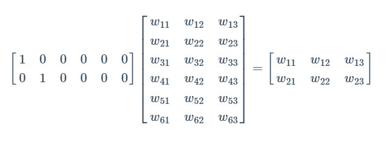
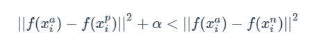
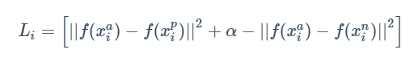
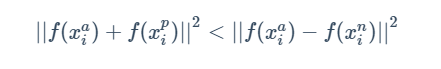
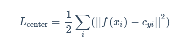
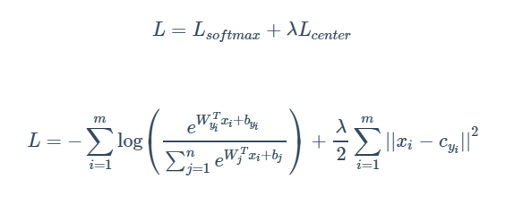

# Facenet-Opensource-Tool


## Content

- [Theory](#theory)
- [Procedures](#procedures)
- [References](#references)

## Theory

1. [Facenet简介](#facenet简介)
2. [Facenet公式公理](#facenet公式公理)


### 1. Facenet简介 <span id = "facenet简介">

**(1) 概述**

Facenet是<font color=800080>直接学习图像到欧式空间(Euclidean space)上点的映射，两张图像所对应的特征的欧式空间上的点的距离直接对应着两个图像是否相似</font>。如下图：


用数字表示这图像特征之间的欧式距离，正常来说，图像的类内距离明显的小于类间距离，阈值大约为1.1左右。

**(2) Facenet的结构** 


如图所示：Deep Architecture就是卷积神经网络去掉sofmax后的结构，经过L2的归一化，然后得到特征表示，基于这个特征表示计算三元组损失。

- batch ：是指输入的人脸图像样本，这里的样本是已经经过人脸检测找到人脸并裁剪到固定尺寸（例如160x160）的图片样本。
- Deep architecture：指的是采用一种深入学习架构例如imagenet历年冠军网络中的ZF，googlenet等。
  L2 ：是指特征归一化（使其特征的||f(x)||2=1,这里是2次方的意思。这样所有图像的特征都会被映射到一个超球面上)
- Embeddings： 就是前面经过深度学习网络，L2归一化后生成的特征向量（这个特征向量就代表了输入的一张样本图片）
- riplet Loss： 就是有三张图片输入的Loss（之前的都是Double Loss或者 是 SingleLoss）。直接学习特征间的可分性：相同身份之间的特征距离要尽可能的小，而不同身份之间的特征距离要尽可能的大。

**(3) 细节**

- [FaceNet--Google的人脸识别](https://blog.csdn.net/stdcoutzyx/article/details/46687471)
  - 目标函数
  - 三元组的选择
  - 网络模型
  - 数据和评测
  - 网络结构的不同
  - 图像质量的不同
  - 最终生成向量表示的大小的不同
  - 训练数据大小的不同
  - 对齐与否
- 


### 2. Facenet公式公理 <span id = "facenet公式公理">

人脸相关任务其实分为两部分:人脸检测和人脸识别。

- 人脸检测:就是获取图像中所有人脸的位置，并对人脸进行对齐。由于原始图像中的人脸可能存在姿态、位置上的差异，我们需要在获取人脸位置后，检测人脸中的关键点，根据这些关键点将人脸统一校准，以消除姿势不同带来的误差。这方面代表性的算法是MTCNN算法。
- 人脸识别:输入一张人脸，判断其属于人脸数据集中的哪一个人。这方面的代表算法是facenet。具体来说，就是使用深度卷积网络，将输入的人脸图像转换为一个向量，然后与数据集中各个人脸的向量计算两个向量之间的欧氏距离，对于同一个人的人脸图像，对应的两个向量之间的欧氏距离应该比较小，反之则较大。

**(1) Facenet网络结构**

```
NN1/NN2/NN3/NN4/NNS1/NNS2（不同的卷积神经网络）->L2归一化->嵌入层（Embedding）->计算三元组损失（Triplet Loss）和各参数梯度，更新权重
```

所谓嵌入层（Embedding），可以理解为是一种映射关系，即将特征从原来的特征空间中映射到一个新的特征空间，新的特征就可以称为原来特征的一种嵌入。

这里的映射关系是将卷积神经网络末端全连接层输出的特征映射到一个超球面上，也就是使其特征的L2范数归一化，然后再计算三元组损失和各参数梯度，更新权重。


**各个神经网络的全称和使用该网络作为facenet的卷积神经网络时最终在验证集上的准确率:**

```
NN1 (Zeiler&Fergus 220×220) 87.9% ± 1.9 
NN2 (Inception 224×224) 89.4% ± 1.6 
NN3 (Inception 160×160) 88.3% ± 1.7 
NN4 (Inception 96×96) 82.0% ± 2.3 
NNS1 (mini Inception 165×165) 82.4% ± 2.4 
NNS2 (tiny Inception 140×116) 51.9% ± 2.9
```

**(2) 嵌入层（Embedding）原理**

Embedding产生的原因主要是因为使用one-hot编码时产生的向量维度很高且非常稀疏。比如我们在做自然语言处理（NLP）中遇到了一个包含2000个词的字典，使用one-hot编码时，每一个词需要用一个2000维的向量来表示，且其中1999维为0。
Embedding的主要目的就是对稀疏特征进行降维。看下面这个例子:



左边第一个矩阵是one_hot编码2x6矩阵，将其输入节点数为3的全连接层，就可以得到右边降维后的输出矩阵。原本的6维的one_hot编码向量经过Embedding层被降为3维向量。

事实上，Embedding层就是以one hot为输入、中间层节点为字向量维数的全连接层，这个全连接层的参数，就是一个”字向量表”。全连接层的节点数被称为”潜在因子”。

由于在深度神经网络的训练过程中这个全连接层权重也会被更新，如果输入为一个词语集合的one_hot编码，我们就可以对齐进行有效的降维，同时降维后的两两嵌入向量各个维度上的取值之间的差值（距离）还表示这两个嵌入向量代表的词在高维空间上的相似度有多少，我们可以类似使用t-SNE这样的降维技术将这些相似性可视化。

**(3) 直接使用欧氏距离作为损失函数的缺陷**

如果我们直接以欧氏距离作为损失函数，模型的训练会出现这样的问题：对于人脸来说，每一类就是一个人，然而每一类中会有很多个样本（一个人有很多照片），直接用欧氏距离相当于<font color=800080>只考虑了类内距离，未考虑类间距离</font>，但实际上有时候类内距离会比类间距离大。
比如我们可以对MNIST数据集（0-9十个数字的图片）进行降维，使得每张图片最后降维2维，这样每一张图片都是直角坐标系上的一个点，我们可以将所有样本点画在一张图上。我们希望的是类内距离尽可能近，而类间距离尽可能远，但在图上我们会发现，类内中两端样本点之间的距离比图中心不同类之间样本点之间的距离更大。

**(4) 三元组损失（Triplet Loss）**

实际上三元组损失在facenet之前已经有人提出了，但这里我们以facenet中的三元组损失函数来解释。

论文:[FaceNet: A Unified Embedding for Face Recognition and Clustering](https://arxiv.org/pdf/1503.03832.pdf)

<font color=800080>为了解决上面直接用欧氏距离作为损失函数的缺陷，facenet中使用了三元组损失函数</font>。每次在训练数据中抽出三张人脸图像，第一张图像标记为xai，第二张图像标记为xpi，第三张图像标记为xni。xai和xpi对应的是同一个人的图像，而xni是另外一个人的人脸图像。
我们用更加正式的名称来称呼上面三张图像。一个输入的三元组包括一对正样本对和一对负样本对。三张图片分别命名为固定图片（Anchor，a）、正样本图片（Positive，p）和负样本图片（Negative，n）。<font color=800080>图片a和图片p为一对正样本对，图片a和图片n为一对负样本对</font>。
三元组损失要求满足以下不等式:



**即相同人脸间的距离平方至少要比不同人脸间的距离平方小α（取平方主要是为了方便求导）。**
三元组损失函数为:



使用三元组损失函数训练人脸模型的过程:

- 最小化三元组损失函数实际上就是最小化同类样本的距离，同时最大化非同类样本的距离。

- 但是我们在学习模型时最小化上面的损失函数时有一定的技巧。如果对于上面的损失函数每次都是随机选择三元组，虽然模型可以正确的收敛，但是并不能达到最好的性能，而且往往要训练很久，这会是一个很大的工作量。

- 因此在实现时，我们在正样本图片（Positive，p）中选择一个<font color=800080>最不像正样本的样本</font>（具体来说就是与固定图片a相距最远的相同脸样本），在负样本图片（Negative，n）中选择一个<font color=800080>最像正样本的样本</font>（即与固定图片a相距最近的非相同脸样本，最容易被混淆），这样计算出的损失距离就是最大的距离，优化这样的损失函数即可，当采用这种方式算出来的值都能达到要求时，其他样本也能达到要求。

- 采用上述方法选择三元组时也存在一个弊端，即在选取最近和最远的元素时也需要遍历所有的样本，遍历所有的样本也有很大的工作量。对此，可以采用<font color=800080>分批查找</font>的方式。因为图片的执行是分批的，我们可以在每批图片处理的时候找出对应的符合条件的正样本图片（Positive，p）和负样本图片（Negative，n）的样本。

- 为了保证该方法选出的数据合理。在生成对应的批图片时保证每个人平均有40张图片并且随机加入反例进去。同时在选取负样本图片（Negative，n）时遵循半难（semi-hard）约束条件:

  

- <font color=800080>使用三元组损失训练人脸模型通常需要非常大的人脸数据集，才能取得较好的效果。另外模型的收敛速度也较慢</font>。

**(5) 中心损失（Center Loss）**

我们还可以使用中心损失+softmax交叉熵损失作为总损失函数训练facenet模型，可以明显加快模型收敛速度。

论文:[CenterLoss - A Discriminative Feature Learning Approach for Deep Face Recognition](http://www.eccv2016.org/files/posters/P-3B-20.pdf)（这篇论文原文要收费才可浏览，我们看看这个ppt中的摘要吧）

- 中心损失不直接对距离进行优化，它保留了原有的分类模型，但又为每个类（在人脸模型中，一个类就对应一个人)指定了一个类别中心。同一类图像对应的特征都应该尽量靠近自己的类别中心，不同类的类别中心尽量远离。中心损失可以让训练处的特征具有”内聚性”。

- 与三元组损失函数相比，使用中心损失训练人脸模型不需要使用特别的采样方法，而且利用较少的图像就可以达到与单元组损失相似的效果。

- 设输入的人脸图像为xi，该人脸对应的类别是yi，对每个类别都规定一个类别中心，记作cyi。希望每个人脸图像对应的特征f（xi）都尽可能接近中心cyi。

- 中心损失函数为:

  

- 如何确定每个类别的中心cyi呢？类别yi的最佳中心应该是它对应所有图片的特征的平均值。但每次梯度下降时对所有图片计算cyi的时间代价太高了。我们使用一种近似方法，在初始阶段，先随机确定cyi，接着在每个batch内，对当前batch内的cyi也计算梯度，并使得该梯度更新cyi，此外，还需要加入softmax损失。

- 总损失函数L最后由两部分组成:

  

  其中λ是一个超参数。当权重λ越大时，生成的特征就会具有越明显的”内聚性”（每个类的样本分类后会单独聚集在一团，中心cyi在这一团的中心）。

  softmax交叉熵损失使类间距离变大，中心损失是计算某一图片与该类别图片embeddings的均值的损失，为了使类间距离变小。

- 使用中心损失训练人脸模型的过程:随机初始化各个中心cyi；不断地取出一个batch进行训练，在每个batch中，使用总的损失函数L，除了对神经网络参数计算梯度更新外，也对cyi进行计算梯度，并更新中心的位置。


## Procedures

1. [学习facenet精简版](#学习facenet精简版)
2. 
3. 
4. 


### 1. 学习facenet精简版 <span id = "学习facenet精简版">

1. **下载facenet精简版代码**：想了解facenet的源码，强烈建议先下载这个：[facenet精简版](https://github.com/boyliwensheng/understand_facenet)，这个代码用于学习以及入门facenet用。（Latest commit on 13 Sep 2018）

   下载并解压：

   

2. **下载预训练模型**：facenet提供了两个预训练模型，分别是基于CASIA-WebFace和MS-Celeb-1M人脸库训练的。（2017年5月12日train出来的）

   链接: [预训练模型百度网盘地址](https://pan.baidu.com/s/1LLPIitZhXVI_V3ifZ10XNg) 密码: 12mh

   

   接着将20170512-110547这个文件拷贝到刚才是文件夹里：

   

   顺便精简一下文件夹的名字，改为facenet。

3. **运行人脸比对程序(compare.py)**：

   facenet可以直接比对两个人脸经过它的网络映射之后的<font color=800080>欧氏距离</font>。 

   

   在compare.py所在目录下放入要比对的文件1.png和2.png，运行compare.py文件，但是会报错。

   这是因为这个程序需要输入参数，在上方的工具栏里选择Run>EditConfigurations ,在Parameters中配置参数：20170512-110547 1.png 2.png。再次运行程序

4. 

5. 

6. 

7. 


