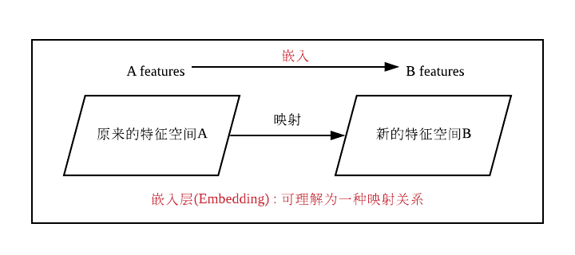
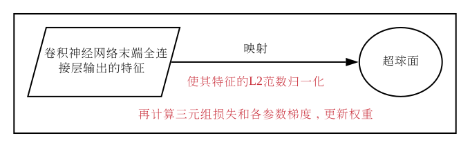
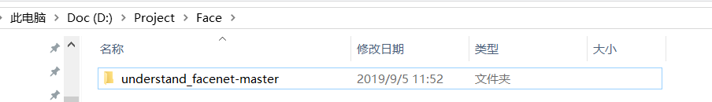
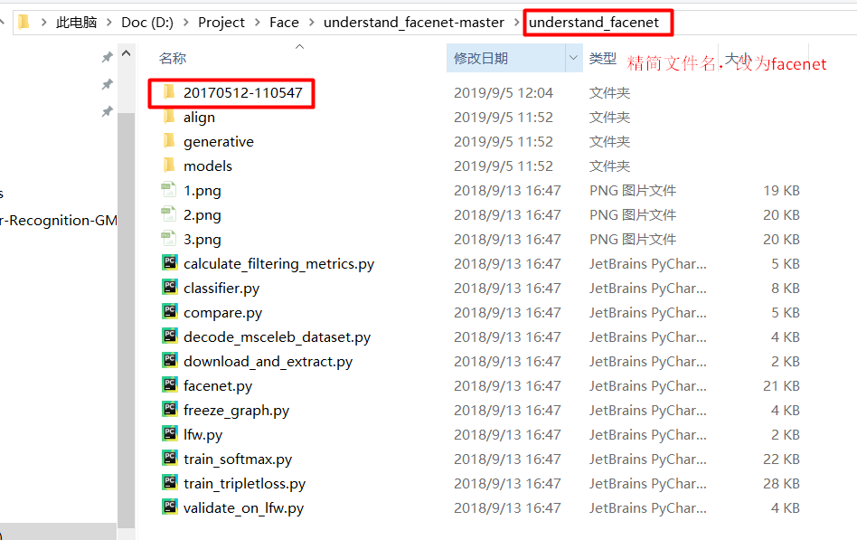
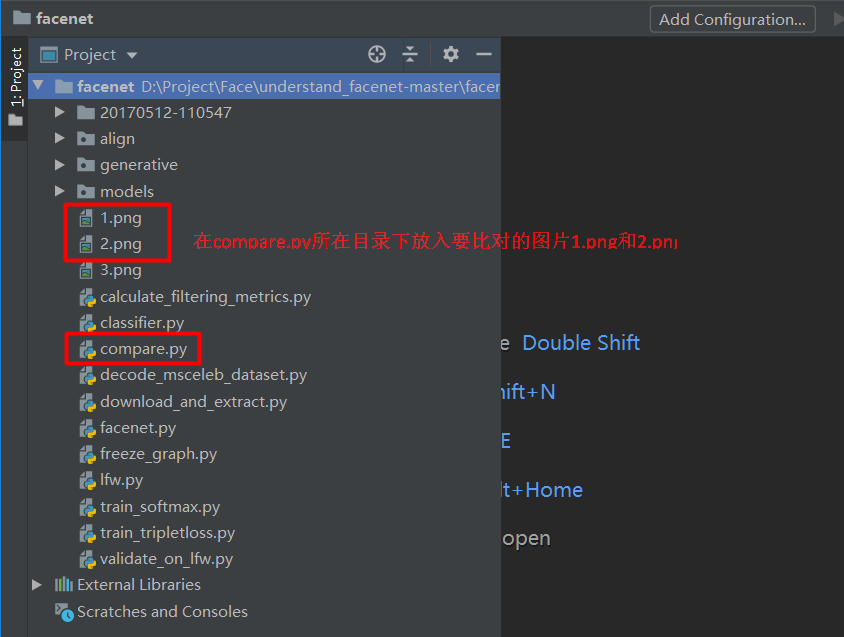

# Facenet-Opensource-Tool


## Content

- [Theory](#theory)
- [Procedures](#procedures)
- [References](#references)

## Theory

1. [Facenet原理](#facenet原理)


### 1. Facenet原理 <span id = "facenet原理">

人脸相关任务其实分为两部分:人脸检测和人脸识别。

- 人脸检测:就是获取图像中所有人脸的位置，并对人脸进行对齐。由于原始图像中的人脸可能存在姿态、位置上的差异，我们需要在获取人脸位置后，检测人脸中的关键点，根据这些关键点将人脸统一校准，以消除姿势不同带来的误差。这方面代表性的算法是MTCNN算法。
- 人脸识别:输入一张人脸，判断其属于人脸数据集中的哪一个人。这方面的代表算法是facenet。具体来说，就是使用深度卷积网络，将输入的人脸图像转换为一个向量，然后与数据集中各个人脸的向量计算两个向量之间的欧氏距离，对于同一个人的人脸图像，对应的两个向量之间的欧氏距离应该比较小，反之则较大。

**Facenet网络结构**

```
NN1/NN2/NN3/NN4/NNS1/NNS2（不同的卷积神经网络）->L2归一化->嵌入层（Embedding）->计算三元组损失（Triplet Loss）和各参数梯度，更新权重
```

所谓嵌入层（Embedding），可以理解为是一种映射关系，即将特征从原来的特征空间中映射到一个新的特征空间，新的特征就可以称为原来特征的一种嵌入。

这里的映射关系是将卷积神经网络末端全连接层输出的特征映射到一个超球面上，也就是使其特征的L2范数归一化，然后再计算三元组损失和各参数梯度，更新权重。



**各个神经网络的全称和使用该网络作为facenet的卷积神经网络时最终在验证集上的准确率:**

```
NN1 (Zeiler&Fergus 220×220) 87.9% ± 1.9 
NN2 (Inception 224×224) 89.4% ± 1.6 
NN3 (Inception 160×160) 88.3% ± 1.7 
NN4 (Inception 96×96) 82.0% ± 2.3 
NNS1 (mini Inception 165×165) 82.4% ± 2.4 
NNS2 (tiny Inception 140×116) 51.9% ± 2.9
```


## Procedures

1. [学习facenet精简版](#学习facenet精简版)
2. 
3. 
4. 


### 1. 学习facenet精简版 <span id = "学习facenet精简版">

1. **下载facenet精简版代码**：想了解facenet的源码，强烈建议先下载这个：[facenet精简版](https://github.com/boyliwensheng/understand_facenet)，这个代码用于学习以及入门facenet用。（Latest commit on 13 Sep 2018）

   下载并解压：

   

2. **下载预训练模型**：facenet提供了两个预训练模型，分别是基于CASIA-WebFace和MS-Celeb-1M人脸库训练的。（2017年5月12日train出来的）

   链接: [预训练模型百度网盘地址](https://pan.baidu.com/s/1LLPIitZhXVI_V3ifZ10XNg) 密码: 12mh

   

   接着将20170512-110547这个文件拷贝到刚才是文件夹里：

   

   顺便精简一下文件夹的名字，改为facenet。

3. **运行人脸比对程序(compare.py)**：

   facenet可以直接比对两个人脸经过它的网络映射之后的<font color=800080>欧氏距离</font>。 

   

   在compare.py所在目录下放入要比对的文件1.png和2.png，运行compare.py文件，但是会报错。

   这是因为这个程序需要输入参数，在上方的工具栏里选择Run>EditConfigurations ,在Parameters中配置参数：20170512-110547 1.png 2.png。再次运行程序

4. 

5. 

6. 

7. 


