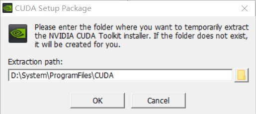

# Install-CUDA-in-Windows

## Content 

1. [查看硬件要求](#查看硬件要求)
2. [查看软件要求](#查看软件要求)
3. [Windows设置](#Windows设置)


## 1. 查看硬件要求

系统支持以下支持 GPU 的设备：<font color=800080>CUDA® 计算能力为3.5或更高的 NVIDIA® GPU卡</font>。请参阅[支持CUDA 的GPU卡](https://developer.nvidia.com/cuda-gpus)列表：


## 2. 查看软件要求

在查看软件要求前先确定自己要安装的tensorflow对python版本的要求：

- 官网地址：https://pypi.org/project/tensorflow/1.1.0rc2/#files

  

- 目前为止（2019），windows环境下，tensorflow只支持python3.5、python3.6，并且只支持64位的系统。


必须在系统中安装以下 NVIDIA® 软件：

##### (1) [NVIDIA®GPU驱动程序](https://www.nvidia.com/drivers) - CUDA 10.0 需要 410.x 或更高版本。

- 

- 查看自己的Windows Driver Type是Standard还是DCH：

  **如何确认我的驱动程序是标准版还是DCH版？**

  由于Intel核显驱动可以直接覆盖安装升级为DCH版驱动，我们这里以Nvidia独显驱动为例，右击桌面空白处，打开Nvidia控制面板，在左下角选择系统信息，在弹出的窗口中有一行“Driver Type”，显示DCH即为DCH驱动，显示Standard即为标准驱动：

  

  

  

- 

##### (2) CUDA®工具包](https://developer.nvidia.com/cuda-toolkit-archive) - TensorFlow 支持 CUDA 10.0（TensorFlow 1.13.0 及更高版本）

- 

- 

##### (3) CUDA 工具包附带的 [CUPTI](https://developer.nvidia.com/rdp/cudnn-download)。

  - 

  - 下载解压后，把cuDNN三个文件夹中的档案，个别复制进CUDA对应的文件夹即可。

    

  - 例如，我的CUDA路径为：

    D:\System\ProgramFiles\NVIDIA GPU Computing Toolkit\CUDA\v10.1

    

    所以就分别把cuDNN文件夹中的bin,include,lib中的文档复制加进CUDA的路径中各自对应的文件夹里即可。

    bin中包含cudnn64_7.dll文件，没有这个文件，tensorflow将无法加载。

  - 环境变量设置：

    新增以下变量：

    ```
    D:\System\ProgramFiles\NVIDIA GPU Computing Toolkit\CUDA\v10.1\bin
    
    D:\System\ProgramFiles\NVIDIA GPU Computing Toolkit\CUDA\v10.1\lib\x64
    ```

  - 检查：

    ```bash
    nvcc -V % 检查是否安装成功
    nvcc --version % 查看CUDA版本
    ```

    

##### (4)（可选）[TensorRT 5.0](https://docs.nvidia.com/deeplearning/sdk/tensorrt-install-guide/index.html)，可缩短在某些模型上进行推断的延迟并提高吞吐量。

首先要确保安装PyCUDA NVCC 在你的 路径
安装tensorflow对应的python版本 


记得注意什么时候出现添加到PATH，一定要勾选。

选择Customize installation。

选择所有的Advanced Options。

手动添加PATH的话，要添加下面两个：

```
D:\System\ProgramFiles\Python3.6.4
D:\System\ProgramFiles\Python3.6.4\Scripts
```

 ```
pip install theano
pip install pycuda
 ```

测试theano有没有安装成功：

```
import theano
```

测试pycuda有没有安装成功：

```
import pycuda
```

测试结果：如果你看到了一堆0那么就要恭喜你了。

## Windows设置

将 CUDA、CUPTI 和 cuDNN 安装目录添加到 `%PATH%` 环境变量中。

```
D:\System\ProgramFiles\NVIDIA GPU Computing Toolkit\CUDA\v10.1\bin

D:\System\ProgramFiles\NVIDIA GPU Computing Toolkit\CUDA\v10.1\extras\CUPTI\lib64

D:\System\ProgramFiles\NVIDIA GPU Computing Toolkit\CUDA\v10.1\include
```


