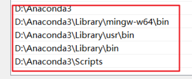

# MesoNet

## Content

- [Download Github Code](#download)
- [Deploy Environment](#deploy)


### Download Github Code

> 我们提出了一种自动检测视频中面部篡改的方法。我们特别关注用于生成超逼真伪造视频的两种最新方法：deepfake和face2face。传统的图像取证技术通常不太适合视频，因为它们的压缩会严重降低数据质量。因此，我们遵循深度学习方法并构建两个网络，两者都具有较少的层数以关注图像的介观特性。我们在现有数据集和我们从在线视频构成的数据集上评估这些快速网络。我们的测试结果表明，对于深度检测，检测成功率超过98％，对于face2face检测成功检测率为95％。

Github地址：https://github.com/DariusAf/MesoNet

Paper地址：[WIFS 2018 conference](http://wifs2018.comp.polyu.edu.hk/)

全文：[Link to full paper](https://arxiv.org/abs/1809.00888)

Youtute：[Demonstrastion video (light)](https://www.youtube.com/watch?v=vch1CmgX0LA)

### Deploy Environment

- Python3.5
- Numpy1.14.2
- Keras2.1.5

如果您想通过视频中的面部提取来使用完整的管道，您还需要以下库：

- [Imageio](https://pypi.org/project/imageio/)
- [FFMPEG](https://www.ffmpeg.org/download.html)
- [face_recognition](https://github.com/ageitgey/face_recognition)

1. 首先，安装Ananconda并添加环境变量：

   

2. ```
   % 打开terminal
   activate % 激活Ananconda虚拟环境
   conda info --env % 查看有那些虚拟环境
   conda create -n python35 python=3.5 % 创建虚拟环境
   conda activate python35 % 激活指定虚拟环境
   pip list % 查看当前虚拟环境下的第三方包有哪些
   pip install numpy==1.14.2 % 安装指定版本第三方包
   pip install keras==2.1.5
   pip install imageio==2.5.0
   pip install ffmpeg
   ```

3. 下载face_recognition库：

   - 先下载dlib库：`pip install dlib`:
     - [@masoudr's Windows 10 installation guide (dlib + face_recognition)](https://github.com/ageitgey/face_recognition/issues/175#issue-257710508)或者可以看我写的<a href = "../docs/Facenet-Opensource-Tool.md/#运行之前要先安装dlib库">教程</a>
     - 先下载安装Microsoft Visual Studio 2015 (or newer) with C/C++ Compiler installed. 
     - [`Boost`](https://blog.csdn.net/qq_27923041/article/details/76153125) library version 1.63 or newer.
   - 

4. 


