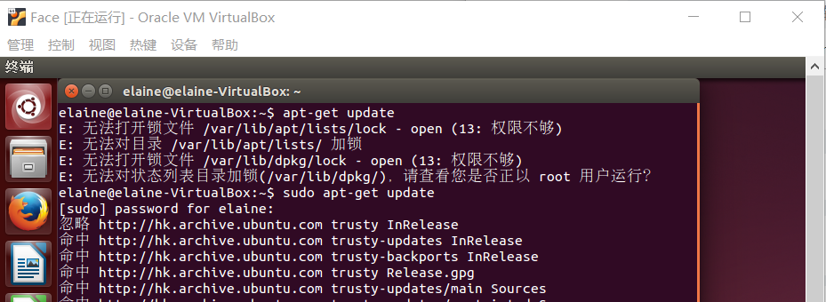
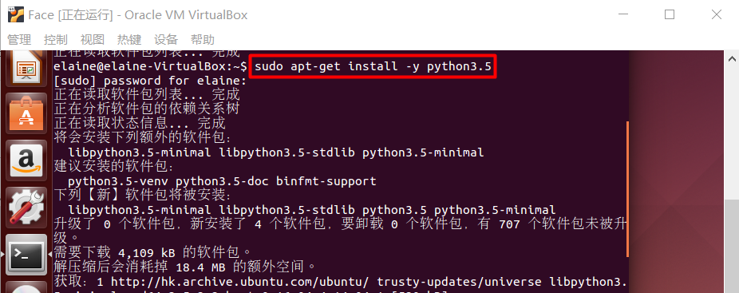
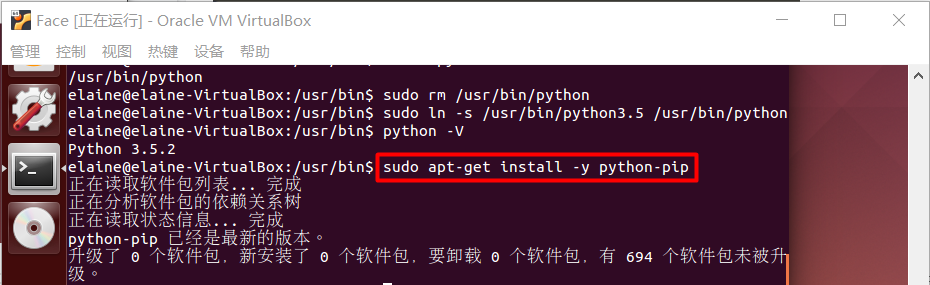

# Sharen

cleverhans包含一组攻击方法：

- untargeted FGSM的代码存储在“fnatk/cleverhans/examples/facenet_adversarial_faces文件夹”中。
- 要生成untargeted FGSM adv图像,请在Pycharm中运行 'fgsm.py' 文件。
- 攻击参数可以在文件 'fgsm.py' 中修改

<font color=800080>**Dockerfile**</font>：

```
FROM ubuntu:14.04
RUN apt-get update
RUN apt-get install -y python
RUN apt-get install -y python-pip
RUN pip install --upgrade pip
COPY .setup_vm_and_run_tests.sh /
RUN chmod +x /.setup_vm_and_run_tests.sh
CMD ["/.setup_vm_and_run_tests.sh"]
```

## Content

- [1. 安装ubuntu14.04系统](#安装ubuntu14.04系统)
- [2. 安装需要的依赖](#安装需要的依赖)


### 1. 安装ubuntu14.04系统 <span id = "安装ubuntu14.04系统">

点击<a href="../docs/windows中安装ubuntu14.04.md">在win10中安装ubuntu14.04</a>，可以看到我写的教程。

### 2. 安装需要的依赖 <span id = "安装需要的依赖">

- [`sudo apt-get update`](#sudo-apt-get-update)
- [`sudo apt-get install -y python`](#sudo-apt-get-install-y-python)
- [`sudo apt-get install -y python-pip`](#sudo-apt-get-install-y-python-pip)
- [sudo pip install --upgrade pip](#sudo-pip-install-upgrade-pip)


##### 1. sudo apt-get update <span id = "sudo-apt-get-update">

windows下安装软件点击exe，ubuntu不是这样，它会维护一个自己的软件仓库，常用的几所所有软件都在这里面（这里面的软件绝对安全且能正常安装），这个仓库有时候会有一些改动，就运行`apt-get update`命令，读取软件列表，然后保存在本地电脑。



##### 2. sudo apt-get install -y python <span id = "sudo-apt-get-install-y-python">

`apt-get`自动从互联网的软件仓库中搜索、安装、升级、卸载软件或者操作系统，该命令需要root权限才能执行即`sudo`。`sudo apt-get install -y python`就是安装python，可以指定安装python3.5版本：`sudo apt-get install -y python3.5`。

ubuntu自带python2.7（不能卸载，卸载会出现意想不到的效果），安装python3.5，再把默认的python指向python3.5即可：

```bash
sudo apt-get install -y python3.5
python -V % 可以看到现在的版本号还是2.7.6 也可以 which python
whereis python % 可以看到python安装的位置
sudo rm /usr/bin/python
sudo ln -s /usr/python3.5 /usr/bin/python
python -V % 现在已经变为3.5.2了
```



##### 3. sudo apt-get install -y python-pip <span id = "sudo-apt-get-install-y-python-pip">

python有两个著名的包管理工具easy_install.py和pip，easy_install.py是默认安装的，pip是需要手动安装的。



##### 4. sudo pip install --upgrade pip <span id = "sudo-pip-install-upgrade-pip">

直接运行是不行的，之前还要做一些操作：

```bash
cd /usr/local/lib/python3.5/dist-packages
sudo apt-get install python3-pip
sudo wget http://bootstrap.pypa.io/get-pip.py
sudo python3.5 get-pip.py
which pip
type pip
hash -r
sudo pip install --upgrade pip
sudo pip install --upgrade setuptools
```


