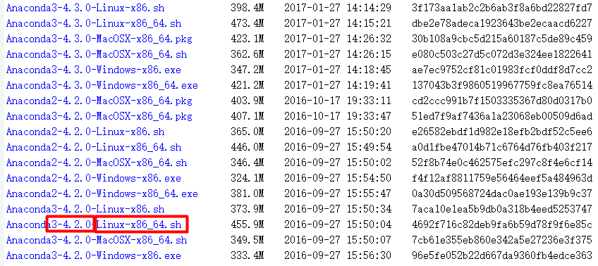
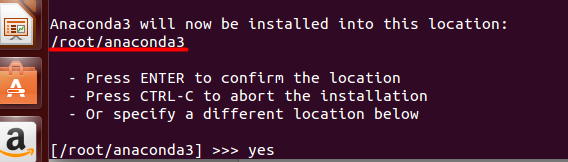
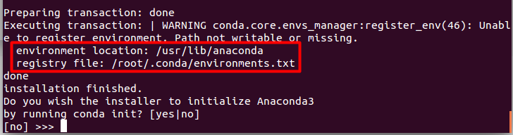
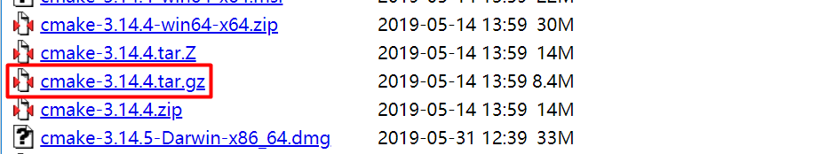
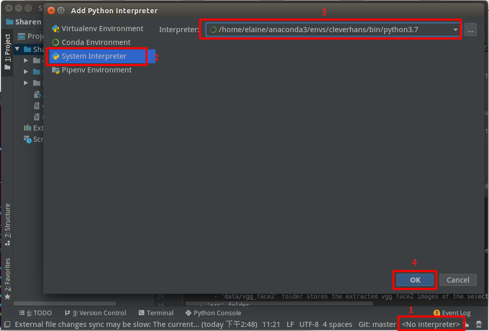

# Sharen

cleverhans包含一组攻击方法：

- untargeted FGSM的代码存储在“fnatk/cleverhans/examples/facenet_adversarial_faces文件夹”中。
- 要生成untargeted FGSM adv图像,请在Pycharm中运行 'fgsm.py' 文件。
- 攻击参数可以在文件 'fgsm.py' 中修改

<font color=800080>**Dockerfile**</font>：

```
FROM ubuntu:14.04
RUN apt-get update
RUN apt-get install -y python
RUN apt-get install -y python-pip
RUN pip install --upgrade pip
COPY .setup_vm_and_run_tests.sh /
RUN chmod +x /.setup_vm_and_run_tests.sh
CMD ["/.setup_vm_and_run_tests.sh"]
```

## Content

- [1. 安装ubuntu14.04系统](#安装ubuntu14.04系统)
- [2. 安装需要的依赖](#安装需要的依赖)
- [3. 安装需要的软件](#安装需要的软件)
- [4. 配置需要的环境](#配置需要的环境)
- [5. cleverhans程序](#cleverhans程序)


### 1. 安装ubuntu14.04系统 <span id = "安装ubuntu14.04系统">

点击<a href="../docs/windows中安装ubuntu14.04.md">在win10中安装ubuntu14.04</a>，可以看到我写的教程。

### 2. 安装需要的依赖 <span id = "安装需要的依赖">

- [`sudo apt-get update`](#sudo-apt-get-update)
- [`sudo apt-get install -y python`](#sudo-apt-get-install-y-python)
- [`sudo apt-get install -y python-pip`](#sudo-apt-get-install-y-python-pip)
- [`sudo pip install --upgrade pip`](#sudo-pip-install-upgrade-pip)


##### (1) sudo apt-get update <span id = "sudo-apt-get-update">

windows下安装软件点击exe，ubuntu不是这样，它会维护一个自己的软件仓库，常用的几所所有软件都在这里面（这里面的软件绝对安全且能正常安装），这个仓库有时候会有一些改动，就运行`apt-get update`命令，读取软件列表，然后保存在本地电脑。


##### (2) sudo apt-get install -y python <span id = "sudo-apt-get-install-y-python">

`apt-get`自动从互联网的软件仓库中搜索、安装、升级、卸载软件或者操作系统，该命令需要root权限才能执行即`sudo`。`sudo apt-get install -y python`就是安装python，可以指定安装python3.5版本：`sudo apt-get install -y python3.5`。

ubuntu自带python2.7（不能卸载，卸载会出现意想不到的效果），安装python3.5，再把默认的python指向python3.5即可：

```bash
sudo apt-get install -y python3.5
python -V % 可以看到现在的版本号还是2.7.6 也可以 which python
whereis python % 可以看到python安装的位置
sudo rm /usr/bin/python
sudo ln -s /usr/python3.5 /usr/bin/python
python -V % 现在已经变为3.5.2了
```


##### (3) sudo apt-get install -y python-pip <span id = "sudo-apt-get-install-y-python-pip">

python有两个著名的包管理工具easy_install.py和pip，easy_install.py是默认安装的，pip是需要手动安装的。


##### (4) sudo pip install --upgrade pip <span id = "sudo-pip-install-upgrade-pip">

直接运行是不行的，之前还要做一些操作：

```bash
cd /usr/local/lib/python3.5/dist-packages
sudo apt-get install python3-pip
sudo wget http://bootstrap.pypa.io/get-pip.py
sudo python3.5 get-pip.py
which pip
type pip
hash -r
sudo pip install --upgrade pip
sudo pip install --upgrade setuptools
```

### 3. 安装需要的软件 <span id = "安装需要的软件">

- [PyCharm](#PyCharm)
- [Ananconda](#Ananconda)
- [Mongodb](#Mongodb)


##### (1) PyCharm <span id = "PyCharm">

- 首先安装umake：

  ```bash
  sudo apt-get install software-properties-common
  sudo add-apt-repository ppa:george-edison55/cmake-3.x
  sudo apt-get install cmake
  sudo apt-get update
  sudo apt-get install ubuntu-make
  ```

- 有了umake，可以使用以下命令来安装PyCharm社区版：

  ```bash
  umake ide pycharm
  % 也可以使用以下命令来安装PyCharm专业版：
  % umake ide pycharm-professional
  % 卸载PyCharm，可以通过umake命令来卸载pycharm
  % umake -r ide pycharm
  ```

  

这样可以运行，但是对于我的分享文件无法打开，因此我试了另一种方法，<a href = "../docs/windows中安装ubuntu14.04.md">点击此处查看</a>。

##### (2) Ananconda <span id = "Ananconda">

- 首先在官网上[下载anaconda3-4.2.0](https://repo.continuum.io/archive/)对应的是Python3.5.2版本：

  

- 下载后进入下载文件所在文件夹下，在终端输入如下代码：

  ```bash
  cd /home/elaine/下载
  bash Anaconda3-4.2.0-Linux-x86_64.sh
  ```

  

  

- 安装完成后重新打开终端输入代码：conda -V查看安装版本。(如果如没有反应，则要更新环境变量`source ~/.bashrc`，这里根据图中显示，应该是`souce /root/.bashrc`)

- 在终端输入python发现依然是Ubuntu自带的python版本，这是因为.bashrc的更新还没有生效，命令行输入： source ~/.bashrc即可。whe

##### (3) Mongodb <span id = "Mongodb">

```bash
% 导入MongoDB 的公钥：
sudo apt-key adv --keyserver hkp://keyserver.ubuntu.com:80 --recv EA312927
% 为MongoDB创建一个list文件:
sudo mkdir mongodb-org-3.2.list
echo "deb http://repo.mongodb.org/apt/ubuntu trusty/mongodb-org/3.2 multiverse" | sudo tee /etc/apt/sources.list.d/mongodb-org-3.2.list
% 更新本地资源包数据
sudo apt-get update
% 安装最新稳定版本MongoDB
sudo apt-get install -y mongodb-org --force-yes
% 启动mongodb：
sudo service mongod start
% 停止mongodb：
sudo service mongod stop
% 重启mongodb：
sudo service mongod restart
```

### 4. 配置需要的环境 <span id = "配置需要的环境">

- [安装python3.7](#安装python3.7)
- [`pip install -r requirements.exe`安装需要的库](#安装需要的库)
- [cd到mongod executable所在的目录(if you want to run the attack gui)](#cd到mongod executable所在的目录)
- [运行`/.mongod`启动mongodb服务器(if you want to run the attack gui)](#启动mongodb服务器)
- [设置Python Interpreter to python.exe in the virtual env in Ananconda](#设置Python-Interpreter)


```bash
%% 先介绍一些常用指令，但这不是配置环境的指定步骤
% 添加环境变量(如果已经存在，不要做此步)
export PATH = "/home/elaine/ananconda3/bin:$PATH"
% 在Ananconda中创建一个新的环境
conda create -n cleverhans python=3.5 
% 查看目前有哪些环境
conda info --env 或 conda env list
% 激活此环境
source activate cleverhans
% 关闭此环境
source deactivate cleverhans
% 删除一个已有的环境
conda env remove -n env_name 
% 分享自己的运行环境
conda env export > env.yaml
% 拿到别人分享的环境(yaml文件)，创建一个一模一样的环境
conda env create -f env.yaml
% 安装包
conda install package_name
% 删除包
conda reomve package_name
% 更新包
conda update package_name
% 查找是否安装某包
conda search package_name
```
##### (1) 安装python3.7 <span id = "安装python3.7">

```bash
%% 配置环境的指定步骤
sudo gpt-get install python-pip
conda install conda
% 安装python的最新版本3.7
% conda install python=3.7 
conda create -n cleverhans python=3.7
% 安装需要的库
cd /mnt/share/Sharen
```
##### (2) `pip install -r requirements.exe`安装需要的库 <span id = "安装需要的库">

```bash
sudo pip install -r requirements.txt
% 报错：No package 'libffi' found
sudo apt-get install libffi-dev
% 再次安装
sudo pip install -r requirements.txt
% 报错：Could not find a version that satisfies the requirement cmake==3.14.4
% 解决：Ubuntu14.04安装CMake3.14.4
% (1) 安装之前需要安装g++
sudo apt-get install g++
% (2) 进入官网下载cmake-3.14.4.tar.gz:https://cmake.org/files/v3.14/
```



```bash
% (3)解压文件，进入cmake-3.14.4 
cd /home/elaine/下载/cmake-3.14.4
sudo ./bootstrap
sudo make
sudo make install
cmake --version % 查看版本信息，返回CMake版本信息，则说明安装成功
% 如果你想要通过CMake安装OpenCV+OpenCV_Contrib 这里安装的CMake有所不同，需要让CMake支持HTTPS，这样后续make的时候才不会报一些古怪的错误
```


```bash
cd /mnt/share/Sharen
sudo pip install -r requirements.txt
```

##### (3) cd到mongod executable所在的目录 <span id = "cd到mongod executable所在的目录">

```bash
where is mongod
cd /usr/bin
```

##### (4) 运行`/.mongod`启动mongodb服务器 <span id = "启动mongodb服务器">

```bash
./mongod
```

##### (5) 设置Python Interpreter to python.exe in the virtual env in Ananconda <span id = "设置Python-Interpreter">

```bash
% ~代表/home/elaine
cd ~/anaconda3/envs/cleverhans/bin % 里面有python3.7.exe
gnome-open ~/anaconda3/envs/cleverhans/bin
% 到pycharm里设置interpreter的时候就选择这个路径下的python3.7.exe
```



### 5. cleverhans程序 <span id = "cleverhans程序">

- [untargeted FGSM code](#untargeted-FGSM-code)
  - `in 'cleverhans/examples/facenet_adversarial_faces'`
- [generate untargeted FGSM adv image](#generate-untargeted-FGSM-adv-image)
  - `fgsm.py`
- [change attack parameters](#change-attack-parameters)
  - `fgsm.py`

**requirements.txt**

```
absl-py==0.7.1
asn1crypto==0.24.0
astor==0.7.1
atomicwrites==1.3.0
attrs==19.1.0
beautifulsoup4==4.7.1
boost==0.1
certifi==2019.6.16
cffi==1.12.3
chardet==3.0.4
Click==7.0
cmake==3.14.4
conda==4.7.5
conda-build==3.18.7
conda-package-handling==1.3.11
cryptography==2.7
cycler==0.10.0
decorator==4.4.0
dlib==19.17.0
filelock==3.0.12
Flask==1.0.3
gast==0.2.2
glob2==0.7
grpcio==1.16.1
h5py==2.9.0
idna==2.8
imageio==2.5.0
imgaug==0.2.9
importlib-metadata==0.18
imutils==0.5.2
itsdangerous==1.1.0
Jinja2==2.10.1
joblib==0.13.2
Keras==2.2.4
Keras-Applications==1.0.6
Keras-Preprocessing==1.0.5
kiwisolver==1.1.0
libarchive-c==2.8
lief==0.9.0
Markdown==3.1.1
MarkupSafe==1.1.1
Mastodon.py==1.4.5
matplotlib==3.1.0
mkl-fft==1.0.12
mkl-random==1.0.2
mock==3.0.5
more-itertools==7.2.0
networkx==2.3
numpy==1.16.4
opencv-python==4.1.0.25
packaging==19.0
pandas==0.24.2
Pillow==6.0.0
pkginfo==1.5.0.1
pluggy==0.12.0
protobuf==3.8.0
psutil==5.6.3
py==1.8.0
pycosat==0.6.3
pycparser==2.19
pymongo==3.8.0
pyOpenSSL==19.0.0
pyparsing==2.4.0
PyQt5==5.13.0
PyQt5-sip==4.19.18
pyqtgraph==0.10.0
PySocks==1.7.0
pytest==5.0.1
python-dateutil==2.8.0
python-magic==0.4.15
pytz==2019.1
PyWavelets==1.0.3
PyYAML==5.1.1
requests==2.22.0
ruamel-yaml==0.15.46
scikit-image==0.15.0
scikit-learn==0.21.2
scipy==1.2.1
Shapely==1.6.4.post2
six==1.12.0
sklearn==0.0
soupsieve==1.8
SQLAlchemy==1.3.5
tensorboard==1.13.1
tensorboardX==1.8
tensorflow==1.13.1
tensorflow-estimator==1.13.0
termcolor==1.1.0
torch==1.1.0
torchvision==0.3.0
tqdm==4.32.2
urllib3==1.25.3
wcwidth==0.1.7
Werkzeug==0.15.4
xcrun==0.4
zipp==0.5.2
```

##### (1) untargeted FGSM code <span id = "untargeted-FGSM-code">

```bash
% 进入PyCharm里的Terminal,当前目录是/mnt/share/Sharen
cd cleverhans/examples/facenet_adversarial_faces
python fgsm.py
```

```bash
% --------------这里是改错的部分--------------
pip install pip -U % pip升级版本
% 1. 安装tensorflow1.13.1
pip3 install tensorflow==1.13.1
pip list
% 2. 安装keras2.2.4
pip3 install keras==2.2.4
% 3. 安装torch1.1.0
pip3 install torch==1.1.0
% 4. 安装其他的包
pip3 install absl-py==0.7.1
pip3 install asn1crypto==0.24.0
pip3 install astor==0.7.1
pip3 install atomicwrites==1.3.0
pip3 install attrs==19.1.0
pip3 install beautifulsoup4==4.7.1
pip3 install boost==0.1
pip3 install certifi==2019.6.16
pip3 install cffi==1.12.3
pip3 install chardet==3.0.4
pip3 install Click==7.0
pip3 install cmake==3.14.4
pip3 install conda==4.7.5 %%
pip3 install conda-build==3.18.7 %%
pip3 install conda-package-handling==1.3.11 %%
pip3 install cryptography==2.7
pip3 install cycler==0.10.0
pip3 install decorator==4.4.0
pip3 install dlib==19.17.0
pip3 install filelock==3.0.12
pip3 install Flask==1.0.3
pip3 install gast==0.2.2
pip3 install glob2==0.7
pip3 install grpcio==1.16.1
pip3 install h5py==2.9.0
pip3 install idna==2.8
pip3 install imageio==2.5.0
pip3 install imgaug==0.2.9
pip3 install importlib-metadata==0.18
pip3 install imutils==0.5.2
pip3 install itsdangerous==1.1.0
pip3 install Jinja2==2.10.1
pip3 install joblib==0.13.2
pip3 install Keras==2.2.4
pip3 install Keras-Applications==1.0.6
pip3 install Keras-Preprocessing==1.0.5
pip3 install kiwisolver==1.1.0
pip3 install libarchive-c==2.8
pip3 install lief==0.9.0
pip3 install Markdown==3.1.1
pip3 install MarkupSafe==1.1.1
pip3 install Mastodon.py==1.4.5
pip3 install matplotlib==3.1.0
pip3 install mkl-fft==1.0.12
pip3 install mkl-random==1.0.2
pip3 install mock==3.0.5
pip3 install more-itertools==7.2.0
pip3 install networkx==2.3
pip3 install numpy==1.16.4
pip3 install opencv-python==4.1.0.25
pip3 install packaging==19.0
pip3 install pandas==0.24.2
pip3 install Pillow==6.0.0
pip3 install pkginfo==1.5.0.1
pip3 install pluggy==0.12.0
pip3 install protobuf==3.8.0
pip3 install psutil==5.6.3
pip3 install py==1.8.0
pip3 install pycosat==0.6.3
pip3 install pycparser==2.19
pip3 install pymongo==3.8.0
pip3 install pyOpenSSL==19.0.0
pip3 install pyparsing==2.4.0
pip3 install PyQt5==5.13.0
pip3 install PyQt5-sip==4.19.18
pip3 install pyqtgraph==0.10.0
pip3 install PySocks==1.7.0
pip3 install pytest==5.0.1
pip3 install python-dateutil==2.8.0
pip3 install python-magic==0.4.15
pip3 install pytz==2019.1
pip3 install PyWavelets==1.0.3
pip3 install PyYAML==5.1.1
pip3 install requests==2.22.0
pip3 install ruamel-yaml==0.15.46
pip3 install scikit-image==0.15.0
pip3 install scikit-learn==0.21.2
pip3 install scipy==1.2.1
pip3 install Shapely==1.6.4.post2
pip3 install six==1.12.0
pip3 install sklearn==0.0
pip3 install soupsieve==1.8
pip3 install SQLAlchemy==1.3.5
pip3 install tensorboard==1.13.1
pip3 install tensorboardX==1.8
pip3 install tensorflow==1.13.1
pip3 install tensorflow-estimator==1.13.0
pip3 install termcolor==1.1.0
pip3 install torch==1.1.0
pip3 install torchvision==0.3.0
pip3 install tqdm==4.32.2
pip3 install urllib3==1.25.3
pip3 install wcwidth==0.1.7
pip3 install Werkzeug==0.15.4
pip3 install xcrun==0.4
pip3 install zipp==0.5.2
```


##### (2) generate untargeted FGSM adv image <span id = "generate-untargeted-FGSM-adv-image">


##### (3) change attack parameters <span id = "change-attack-parameters">


