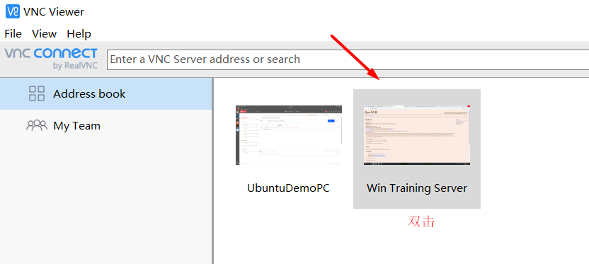

# Training-Server-Details

## Content

- [VNC](#vnc)
- [查看GPU的利用率](#查看GPU的利用率)

## VNC

- [client上安装vncviewer](#client上安装vncviewer)
- [server上安装vncserver](#server上安装vncserver)
- [开启vnc服务](#开启vnc服务)
- [修改原有xstartup文件以图形化访问](#修改原有xstartup文件以图形化访问)
- [先停止vncserver服务](#先停止vncserver服务)
- [重启vncserver服务](#重启vncserver服务)
- [客户端vncviewer建立连接](#客户端vncviewer建立连接)
- [客户端vncviewer启动连接](#客户端vncviewer启动连接)

VNC (Virtual Network Console)，即虚拟网络控制台，它是一款基于 UNIX 和 Linux 操作系统的优秀<font color=800080>远程控制工具软件</font>，由著名的 AT&T 的欧洲研究实验室开发，远程控制能力强大，高效实用，并且<font color=800080>免费开源</font>。

VNC基本上是由两部分组成：一部分是**客户端的应用程序(vncviewer)**；另外一部分是**服务器端的应用程序(vncserver)**。

在任何安装了客户端的应用程序(vncviewer)的计算机都能十分方便地与安装了服务器端的应用程序(vncserver)的计算机相互连接。

#### (1) client上安装vncviewer <span id = "client上安装vncviewer">

- 去VNC的官网下载上述的[vncviewer](https://www.realvnc.com/en/connect/download/viewer/)

  

- 下载完成后，得到.exe文件，双击安装即可。

#### (2) server上安装vncserver <span id = "server上安装vncserver">

- 如果server是windows，安装方法和上面一样。

- 如果系统是linux，终端输入：

  ```bash
  sudo apt-get install vnc4server
  ```

  linux系统就会自动安装vncserver。

#### (3) 开启vnc服务 <span id = "开启vnc服务">

- 安装成功后，需要开启vnc服务。

- 终端输入：

  ```bash
  vncserver
  ```

- 首次启动会要求设置密码（不能超过8位)，用来在客户端访问时使用，后面可以使用vncpasswd 修改。

- 运行完vncserver设置密码之后：

  ```bash
  .... $ vncserver : 2
  ```

  因为端口1已经被另外一个小伙伴用了。

- 此时vncserver已经产生了一个新的桌面，其中`:2`是端口号，用于vnc客户端远程连接端口的。

  并且会根据//home/lincanran/.vnc/xstartup（即用户主目录下的 .vnc/xstartup)文件的配置进行启动，

  相关的log运行记录保存在/home/lincanran/.vnc/dw:2.log

- 启动vnc成功后，会在主目录/home/lincanran/下产生一个.vnc目录。

  默认的配置文件是~/.vnc/xstartup。

- 刚安装完如果不修改配置文件的话，从客户端连接时将看不到完整的桌面，而只有一个Terminal窗口。也就是只有一个终端窗口没有图形界面，这显然不是我们想要的，那么如何图形化访问呢？这就需要修改vnc的配置文件xstartup。

#### (4) 修改原有xstartup文件以图形化访问 <span id = "修改原有xstartup文件以图形化访问">

- 终端输入：

  ```bash
  sudo vim /home/lincanran/.vnc/xstartup
  ```

  后面的  /home/lincanran/.vnc/xstartup  就是你的xstartup配置文件所在的地址，根据你自己的地址修改一下。

- 默认配置文件~/.vnc/xstartup如下：

  ```bash
  #!/bin/sh
  # Uncomment the following two lines for normal desktop:
  # unset SESSION_MANAGER
  # exec /etc/X11/xinit/xinitrc
   
  [ -x /etc/vnc/xstartup ] && exec /etc/vnc/xstartup
  [ -r $HOME/.Xresources ] && xrdb $HOME/.Xresources
   xsetroot -solid grey
   vncconfig -iconic &
   x-terminal-emulator -geometry 80x24+10+10 -ls -title "$VNCDESKTOP Desktop" &
   x-window-manager &
  ```

- 将所有内容替换为下面的内容即可：

  ```bash
  #!/bin/sh
   
  # Uncomment the following two lines for normal desktop:
  unset SESSION_MANAGER
  unset DBUS_SESSION_BUS_ADDRESS  
  # 上面这句话在XUbuntu桌面环境下开启vnc的话最好取消注释
  #exec /etc/X11/xinit/xinitrc
  #上面这行先不要打开
  [ -x /etc/vnc/xstartup ] && exec /etc/vnc/xstartup
  [ -r $HOME/.Xresources ] && xrdb $HOME/.Xresources
  xsetroot -solid grey
  vncconfig -iconic &
  x-terminal-emulator -geometry 80x24+10+10 -ls -title "$VNCDESKTOP Desktop" &
  #gnome-session &
  #x-window-manager &
  #下面这块主要是针对运用xfce4管理桌面
  x-session-manager & xfdesktop & xfce4-panel &
  xfce4-menu-plugin &
  xfsettingsd &
  xfconfd &
  xfwm4 &
  ```

#### (5) 先停止vncserver服务 <span id = "先停止vncserver服务">

- 配置完成后，我们需要先停止一下之前打开的vncserver：

  ```bash
  vncserver -kill :2
  ```

#### (6) 重启vncserver服务 <span id = "重启vncserver服务">

- 终端输入：

  ```bash
  vncserver :2
  ```

  这时候我们得到端口号为2

#### (7) 客户端vncviewer建立连接 <span id = "客户端vncviewer建立连接">

配置好服务器端，接下来就很简单了，就是通过之前安装好的Windows下的vncviewer建立连接，去访问服务器。

- 打开vncviewer。

- 点击左上角File，然后点击New Connection：这里只需要填2个地方：即VNC Server和Name。

- 

- VNC Server是你需要访问的服务器的地址IP，注意：地址后面还要加上`:2`。因为我们刚刚分配的端口就是2。

  Name是你给这个连接起的名字。

- 最后点击OK，创建连接。

#### (8) 客户端vncviewer启动连接 <span id = "客户端vncviewer启动连接">

只需双击我们的training server，即可启动连接。



注意：启动连接之前，要保证你服务器端，已经开启服务了，也就是已经输入过：

```bash
vncserver :2
```

## 查看GPU的利用率

在用GPU跑并行运算的时候，我们经常会需要<font color=800080>查看GPU的利用率，温度和显存占用率</font>。但对于windows系统而言，在任务管理器内只能看到CPU的利用率和内存占有率等信息，根本没有GPU的相关信息。

- 只要在文件夹C:\Program Files\NVIDIA Corporation\NVSMI里找到文件nvidia-smi.exe，把该文件拖到命令提示符窗口（win+R，再输入‘CMD’进入），就可以显示关于GPU的信息。

- 如果没有NVSMI，可以到这里下载：https://pan.baidu.com/share/init?surl=siAJ8uFgmcrhDTpVPWMmBQ ，提取码：rzmc。

- 如果在该文件下无法解压，则需要修改win10文件夹的权限：

  

  然后在“安全”选项卡里，点击“高级”：

  

  然后点击“所有者”后面的“更改”链接：

  

  接着，在“选择用户和组”界面中，点击“高级”按钮：

  

  然后，点击“立即查找”按钮，并在列出的用户和组中选择自己登陆的账户，然后点击“确定”按钮：

  

  点击“确定”后回到“安全设置”界面（就是Advanced Security Settings for NVIDIA Corporation），勾选“替换子容器和对象所有者”，然后点击“确定”：

  

  回到文件或文件夹属性的“安全”界面，然后点击“编辑”按钮，设置你刚添加的帐户为“完全控制”，然后确定即可。最后再确定退出文件属性，就可以对文件进行操作了。


