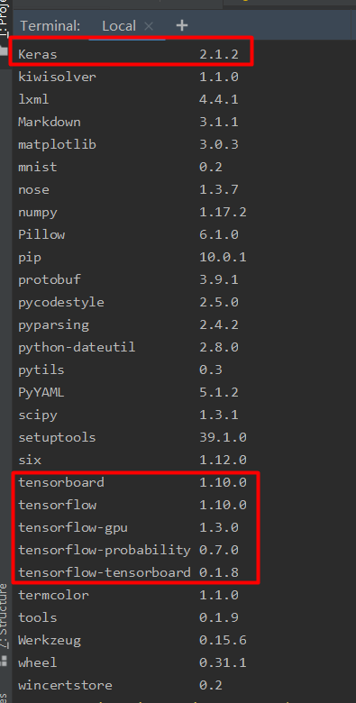

# cleverhans

## Content

- [Download Github Code](#download-github-code)
- [Deploy Environment](#deploy-environment)
- [Scripts](#scripts)
- [Examples](#examples)
- [Ready-to-hand](#ready-to-hand)


### 1. Download Github Code <span id = "download-github-code">

这个项目是tensorflow的子项目（https://github.com/tensorflow/cleverhans），原始的代码版本是PYTHON 2.7环境，于代码下载后进行了重构和3.6版本的编译。

CleverHans是一个Python库，用于将机器学习系统中的漏洞与对抗性示例进行对比。具体来说，就是用于构建攻击，构建防御和对两者进行基准测试的对抗性示例库。

CleverHans是一个Python库，用于将机器学习系统的漏洞与对抗性示例进行对比。您可以在随附的博客中了解有关此类漏洞的更多信息。

Github地址：https://github.com/tensorflow/cleverhans

Youtute：https://www.youtube.com/watch?v=CIfsB_EYsVI

IBM Adversarial Robustness Toolbox：https://www.youtube.com/watch?v=gguyhEwoecI

CleverHans将很快支持3个框架：JAX, PyTorch, and TF2。该软件包本身将重点放在其最初的原则上：参考<font color=800080>实施针对机器学习模型的攻击</font>，以帮助针对<font color=800080>对抗性示例</font>对基准模型进行基准测试。

此存储库还将包含两个文件夹：`tutorials/`包含演示CleverHans的特点的脚本，`defenses/`包含在3个支持的框架之一中进行防御的权威实现的脚本，用于在3个受支持的框架之一中包含防御的权威实现的脚本。未来存储库的结构如下所示：

```
cleverhans/
  jax/
    attacks/
      ...
    tests/
      ...
  tf2/
    attacks/
      ...
    tests/
      ...
  torch/
    attacks/
      ...
    tests/
      ...
defenses/
  jax/
    ...
  tf2/
    ...
  torch/
    ...
tutorials/
  jax/
    ...
  tf2/
    ...
  torch/
    ...
```

同时，所有这些文件夹都可以在相应的`future /`子目录中找到。（例如`cleverhans/future/jax/attacks`, `cleverhans/future/jax/tests` ，`defenses/future/jax/`）

### 2. Deploy Environment <span id = "deploy-environment">

- [Dependencies](#dependencies)
- [Installation](#installation)

##### (1) Dependencies <span id = "dependencies">

该库使用TensorFlow来加速许多机器学习模型执行的图形计算。因此，安装TensorFlow是一个先决条件。

你可以在[这里](https://www.tensorflow.org/install/)找到指示。为了获得更好的性能，还建议安装带有GPU支持的TensorFlow（有关如何执行此操作的详细说明，请参阅TensorFlow安装文档）。

安装TensorFlow将处理所有其他依赖项，如numpy和scipy。

##### (2) Installation <span id = "installation">

一旦完成依赖关系，您可以使用pip或克隆此Github存储库来安装CleverHans。

如果使用pip安装CleverHans，请在安装TensorFlow后运行以下命令：

```
pip install cleverhans
```

这将安装上传到Pypi的最新版本。如果您想要安装最新版本，请使用：

```
pip install git+https://github.com/tensorflow/cleverhans.git#egg=cleverhans
```

如果你想对CleverHans进行可编辑的安装，以便开发库并提供更改，首先在GitHub上fork存储库，然后将fork克隆到你选择的目录中：

```
git clone https://github.com/tensorflow/cleverhans
```

然后，您可以在“可编辑”模式下安装本地程序包，以便将其添加到PYTHONPATH：

```
cd cleverhans
pip install -e .
```

虽然CleverHans可能会在许多其他机器配置上工作，但作者目前在Ubuntu 14.04.5 LTS（Trusty Tahr）上使用Python 3.5和TensorFlow {1.8,1.12}对其进行测试。不推荐支持Python 2.7。 CleverHans 3.0.1支持Python 2.7，主分支可能会继续在Python 2.7中运行一段时间，但作者不再在Python 2.7中运行测试，作者不打算在2019-07之后修复仅影响Python 2.7的错误-04。不推荐在1.12之前支持TensorFlow。这些版本的向后兼容性包装可能会在2019-07-07之后删除，作者将不会在该日期之后修复这些版本的错误。对TensorFlow 1.7及更早版本的支持已被弃用：作者不修复这些版本的错误，这些版本的任何剩余包装代码可能会被删除。

如果您有支持请求，请在<font color=800080>StackOverflow</font>上提出问题，而不是在GitHub跟踪器中打开问题。 GitHub问题跟踪器只应用于报告错误或发出功能请求。

##### (3) Scripts <span id = "scripts">

`scripts`目录包含命令行实用程序。在许多情况下，您可以使用它们在已保存的模型上运行CleverHans功能，而无需编写任何自己的Python代码。

您可能希望设置`.bashrc `/ `.bash_profile`文件以将CleverHans脚本目录添加到PATH环境变量中，以便可以从任何目录方便地执行这些脚本。

为了帮助您开始使用此库提供的功能，cleverhans_tutorials /文件夹附带以下教程：

- 带有`FGSM`的MNIST（[代码](https://github.com/tensorflow/cleverhans/blob/master/cleverhans_tutorials/mnist_tutorial_tf.py)）：本教程介绍如何<font color=800080>使用TensorFlow训练MNIST模型</font>，使用快速梯度符号方法<font color=800080>制作对抗性示例</font>，并使用对抗性训练<font color=800080>使模型对对抗性示例更加健壮</font>。

  ```
  % FGSM是 Goodfellow等人提出的比较典型的对抗样本生成算法。
  % 将生成后的FGSM扰动数据送到图像识别模型中如代码中给出的inceptionv3中，可以看到图像的识别结果全部变乱了。
  % cleverhans集成的代码也是tensorflow models中的相关代码。
  % 本质上而言，它需要在扰动的图片上进行训练，从而才能实现对扰动的代码进行准确识别。
  % 实际代码中，cleverhans提供了两种对抗训练，一种是基于inceptionv3的，一种是inception-resnet-v2的增强版。则扰动后的图片，也能被正确识别。
  ```

- 带有`Keras的FISTM`的MNIST（[代码](https://github.com/tensorflow/cleverhans/blob/master/cleverhans_tutorials/mnist_tutorial_keras_tf.py)）：本教程介绍如何<font color=800080>使用Keras定义MNIST模型</font>并使用TensorFlow训练它，使用快速梯度符号方法制作对抗性示例，并使用对抗性训练使模型对于对抗性示例更加健壮。

- 带有`JSMA`的MNIST（[代码](https://github.com/tensorflow/cleverhans/blob/master/cleverhans_tutorials/mnist_tutorial_jsma.py)）：第二个教程介绍了如何使用Keras定义MNIST模型并使用TensorFlow进行训练，并使用基于雅可比的显着性映射方法制作对抗性示例。

- 带有`黑盒攻击`的MNIST（[代码](https://github.com/tensorflow/cleverhans/blob/master/cleverhans_tutorials/mnist_blackbox.py)）：本教程实现了本文所述的黑盒攻击。对手训练一个替代模型：通过观察黑盒模型分配给对手仔细选择的输入的标签来模仿黑盒模型的副本。然后，对手使用替代模型的渐变来查找由黑盒模型错误分类的对抗性示例。

##### (4) Examples <span id = "examples">

`examples /`文件夹包含其他脚本，用于展示CleverHans库的不同用途，或者让您开始参加不同的对抗示例竞赛。

cleverhans代码库提供了多样性的对抗样本生成方法，具体如下：

```
sample_attacks/ - directory with examples of attacks:
sample_attacks/fgsm/ - Fast gradient sign attack.
sample_attacks/noop/ - No-op attack, which just copied images unchanged.
sample_attacks/random_noise/ - Attack which adds random noise to images.
sample_targeted_attacks/ - directory with examples of targeted attacks:
sample_targeted_attacks/step_target_class/ - one step towards target class attack. This is not particularly good targeted attack, but it demonstrates how targeted attack could be written.
sample_targeted_attacks/iter_target_class/ - iterative target class attack. This is a pretty good white-box attack, but it does not do well in black box setting.
sample_defenses/ - directory with examples of defenses:
sample_defenses/base_inception_model/ - baseline inception classifier, which actually does not provide any defense against adversarial examples.
sample_defenses/adv_inception_v3/ - adversarially trained Inception v3 model from Adversarial Machine Learning at Scale paper.
sample_defenses/ens_adv_inception_resnet_v2/ - Inception ResNet v2 model which is adversarially trained against an ensemble of different kind of adversarial examples. Model is described in Ensemble Adversarial Training: Attacks and Defenses paper.
```

同时也提供了好几个example。还是对抗样本生成与对抗训练非常好的一个库。

你可以在[cleverhans.readthedocs.io](https://cleverhans.readthedocs.io/en/latest/)上找到完整列表攻击及其功能签名。

##### (5) Ready-to-hand <span id = "ready-to-hand">

下面，我将完成如何用`CleverHans`与TensorFlow模型一起使用来制作对抗性示例，以及使模型对对抗示例更加健壮。

- [建立](#建立)
- [使用keras定义模型](#使用keras定义模型)

**建立** <span id = "建立">

首先，确保在您的计算机上安装了[TensorFlow](https://www.tensorflow.org/versions/r0.10/get_started/os_setup.html#download-and-setup) 和[Keras](https://keras.io/#installation)，然后克隆`CleverHans` [存储库](https://github.com/tensorflow/cleverhans)。此外，将存储库克隆的路径添加到 `PYTHONPATH`环境变量中。

```bash
activate
conda info --env
conda  create -n cleverhans python=3.5 % keras支持的python版本是3.5
conda activate cleverhans
pip list % 查看有没有安装tensorflow，如果有，版本是多少
% 安装tf和keras之前注意，他们的版本要对应，网上查
pip install tensorflow-gpu==1.3 % 这之前要先进行tensorflow相关的配置，facenet里面有做过一遍
conda install  keras-gpu=2.1.2
cd D:\Project\Face
d:
mkdir cleverhans
git init
git clone https://github.com/tensorflow/cleverhans
ls
cd cleverhans-master
% 最后，将存储库克隆的路径添加到 PYTHONPATH环境变量中。
% 这允许我们的教程脚本简单地导入库import cleverhans。
```

```
目前已知的keras和tensorflow的对应版本如下：
tensorflow 1.5 和 keras 2.1.4 ,
tensorflow 1.4 和 keras 2.1.3搭配，
tensorflow 1.3 和 keras 2.1.2 搭配，
tensorflow 1.2 和 keras 2.1.1搭配。
```

一定要跟大家分享以下我成功的配置，因为试了很多次，怕以后忘记，就贴在这里，需要的按照这个来配置就可以了：



我们知道`Tensorflow`是有支持`GPU`的版本的，如果我们用`GPU`来加速训练模型速度将会有显著的提升!
当然`Keras`也为我们提供了非常便捷的支持`multi_gpu_model`,如以下代码:我们知道`Tensorflow`是有支持`GPU`的版本的，如果我们用`GPU`来加速训练模型速度将会有显著的提升!
当然`Keras`也为我们提供了非常便捷的支持`multi_gpu_model`,如以下代码：

```python
from keras.utils.training_utils import multi_gpu_model

with tf.device('/cpu:0'):
            model = Xception(weights=None,
                             input_shape=(height, width, 3),
                             classes=num_classes)
# gpus=2 （表示用2个gpu来加速，前提是你的机器上要有2上显示）
multi_gpu_model(model, gpus=2)
```

如果运行代码得到以下错误提示：

```
ValueError: To call `multi_gpu_model` with `gpus=2`, we expect the following devices to be available: ['/cpu:0', '/gpu:0', '/gpu:1']. However this machine only has: ['/cpu:0']. Try reducing `gpus`.
```

这表明，你的机器上有可能没有那么多的显示数量，还有一个重要原因是你所安装的`Tensorflow`或者`Keras`本身并没有`GPU`加速的功能。

检查tensorflow或者keras是否支持GPU加速：

- tensorflow

  ```python
  from tensorflow.python.client import device_lib
  print(device_lib.list_local_devices())
  ```

  如果得到以下 输出信息，则表示你所安装的`tensorflow`版本是支持 `GPU`的。如果输出的信息中没有`gpu`的字样，则说明你安装的`tensorlfow`并不支持`GPU`加速：

  ```
  [
  name: “/cpu:0”device_type: “CPU”,
  name: “/gpu:0”device_type: “GPU”
  ]
  ```

- keras

  ```python
  from keras import backend as K
  print(K.tensorflow_backend._get_available_gpus())
  ```

  如果输出为 `[]`空，则表示你所安装的`Keras`版本并不支持`GPU`。

安装GPU加速的tensorflow和keras：

- tensorflow：

  ```bash
  $ pip install tensorflow      # Python 2.7; CPU support (no GPU support)
  $ pip3 install tensorflow     # Python 3.n; CPU support (no GPU support)
  $ pip install tensorflow-gpu  # Python 2.7;  GPU support
  $ pip3 install tensorflow-gpu # Python 3.n; GPU support
  ```

- keras

  ```
  % Keras可以通Anaconda来安装带GPU加速的Keras版本!
  conda install keras-gpu
  ```

总结步骤：

- 检查你的系统是否有`Nvidia` 的显卡驱动 (`AMD`是无法工作的)。
- 是否已经安装了`GPU`版本的`Tensorflow`和`Keras` (貌似 tensorlfow 1.2及以后的版本在 *macos* 上都不支持 `GPU`, 貌似网上以可以找到方法来破解)。
- 是否已经安装的CUDA有以下几个安装包, 如果你的网络可以翻墙也可以看Gootle Tensorflow的官方文档。
  - [CUDA ToolKit安装请点这里](https://developer.nvidia.com/cuda-zone), [CUDA ToolKit](https://docs.nvidia.com/cuda/cuda-installation-guide-linux/)
  - [cuDNN SDK](https://developer.nvidia.com/cudnn), [cuDNN SDK安装请点这里](https://docs.nvidia.com/deeplearning/sdk/cudnn-install/)
- 根据刚才提到的以上方法检查`GPu`是否可以正常的工作了！

**使用keras定义模型** <span id = "使用keras定义模型">

1. 先根据`cleverhans/setup.y`中的配置检查自己安装的各个包的版本，符不符合要求。

   - 安装中如果出现错误：

     ```
     No module named 'tools.nnwrap'
     ```

     可以尝试使用下面的命令获取pytorch：

     ```bash
     pip3 install https://download.pytorch.org/whl/cu90/torch-1.1.0-cp36-cp36m-win_amd64.whl
     pip3 install https://download.pytorch.org/whl/cu90/torchvision-0.3.0-cp36-cp36m-win_amd64.whl
     ```

     对于其他版本的安装，可以到[这里](https://pytorch.org/get-started/locally/)查找。

2. 认真看README.md，根据其中的要求一步步操作。

3. 来到`scripts`文件夹下，把里面的每一个程序都run一遍：

   - `compute_accuracy.py`

     ```bash
     python compute_accuracy.py
     % 如果出现错误cannot import name 'descriptor'
     pip install --upgrade --no-deps --force-reinstall tensorflow
     卸载TensorFlow。
     卸载protobuf（如果安装了protobuf）。
     重新安装TensorFlow，它还将安装正确的protobuf依赖项。
     ```

     

   - 

   - 

   - 

4. 


