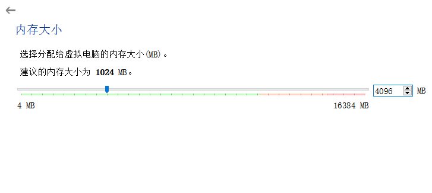
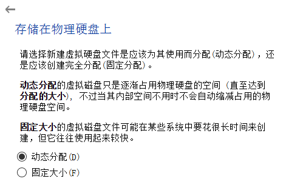

# windows中安装ubuntu14.04

## Content

- [1. 下载安装VirtualBox](#下载安装VirtualBox)
- [2. 创建虚拟机](#创建虚拟机)
- [3. 安装ubuntu系统](#安装ubuntu系统)

### 1. 下载安装VirtualBox 

下载 [VirtualBox](https://www.virtualbox.org/wiki/Downloads)

如果安装期间发生错误，可以[参考这里](https://blog.csdn.net/breavo_raw/article/details/81668247)。

### 2. 创建虚拟机 

创建虚拟机：

根据实际情况选择版本、类型：

先查看自己电脑的内存：此电脑->属性

选择虚拟机内存的大小，当然虚拟机分配的内存大一点好，但是总的内存是固定的，宿主机也要使用，所以要适当：

现在创建：

虚拟文件类型是默认的：

动态分配：

设置文件大小：

创建完成：

### 3. 安装ubuntu系统 

在新建的虚拟机上右键选择”设置“：

