# windows中安装ubuntu14.04

## Content

- [1. 下载安装VirtualBox](#下载安装VirtualBox)
- [2. 创建虚拟机](#创建虚拟机)
- [3. 安装ubuntu系统](#安装ubuntu系统)
- [4. 将win中的文件传给ubuntu](#将win中的文件传给ubuntu)


- )


### 1. 下载安装VirtualBox <span id = "下载安装VirtualBox">

VirtualBox是开源软件，中文界面，比VMware小多了，配置简单，社区活跃，好处多多。

下载 [VirtualBox](https://www.virtualbox.org/wiki/Downloads)


如果安装期间发生错误，可以[参考这里](https://blog.csdn.net/breavo_raw/article/details/81668247)。

### 2. 创建虚拟机 <span id = "创建虚拟机">

创建虚拟机：


根据实际情况选择版本、类型：

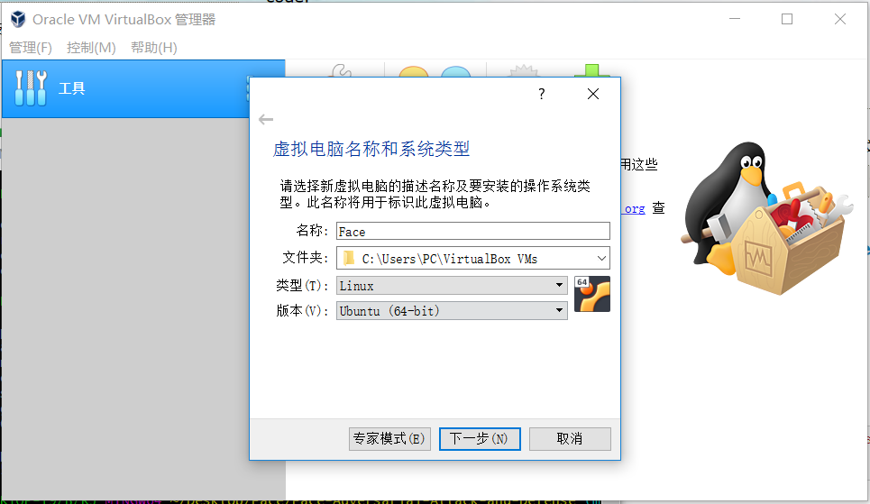

先查看自己电脑的内存：此电脑->属性


选择虚拟机内存的大小，当然虚拟机分配的内存大一点好，但是总的内存是固定的，宿主机也要使用，所以要适当：


现在创建：


虚拟文件类型是默认的：


动态分配：


设置文件大小：


创建完成：


### 3. 安装ubuntu系统 <span id = "安装ubuntu系统">

##### (1) 在新建的虚拟机上右键选择”设置“：


##### (2) 可在”系统”中设置处理器数量，可根据自己电脑实际性能设定：

- 不是客户机的 vCPU 越多，其性能就越好，因为线程切换会耗费大量的时间；应该根据负载需要分配最少的 vCPU。
- 主机上的客户机的 vCPU 总数不应该超过物理 CPU 内核总数。不超过的话，就不存在 CPU 竞争，每个 vCPU 线程在一个物理 CPU 核上被执行；超过的话，会出现部分线程等待 CPU 以及一个 CPU 核上的线程之间的切换，这会有 overhead。
- 将负载分为计算负载和 I/O 负载，对计算负载，需要分配较多的 vCPU，甚至考虑 CPU 亲和性，将指定的物理 CPU 核分给给这些客户机。

此处出现错误：

```
硬件加速配置页已启用硬件虚拟化，但主机并不知支持。需要禁用硬件虚拟化才能启动虚拟机。
```

点开任务管理器-性能-cpu：


显示cpu虚拟化已启动就是正常的，未启动则进入bios里打开vt虚拟化。

出现的原因在于，你电脑的BIOS没有将”虚拟化”选项设为“允许”，解决方法：

```
进入你的BIOS，然后将virtualization（虚拟化）设置为enable即可
% 进入BIOS的方法：开机后连续点击“Delete”键，直到出现BIOS界面
% 不同电脑和厂商，在不同的位置，大致原理一样
1. 重启电脑进入BIOS
2. 找到CPU Configuration> Intel Virtualization Technology
2. DELL的电脑中是：找到Virtualization Support> Virtualization
3. 设置为Enabled
4. 保存退出，重启电脑，再次启动虚拟机
```

启用或禁用硬件虚拟化技术：

```
1. 从 System Utilities 屏幕中，选择 System Configuration（系统配置）---> BIOS/Platform Configuration (RBSU)（BIOS/平台配置）--->System Options（系统选项）--->Virtualization Options（虚拟化选项）--->Virtualization Technology（虚拟化技术）--->Enter
2. 选择一个设置，然后按 Enter
(1) Enabled（已启用）- 让支持该选项的 VMM 能使用 UEFI Intel 处理器提供的硬件功能。
(2) Disabled（已禁用）- 禁止 VMM 使用 UEFI Intel 处理器提供的硬件功能。
3. 按F10
```

看到已经启动还是无法解决，则看本机有没有安装其他的虚拟机产生不兼容，最可能的是自带的hyper-x：

打开控制面板-程序-程序和功能-启动或关闭windows功能：


hyper-v已经启动，这里要是自己不用可以关闭这个功能，把勾去掉就行，如果需要用到vs的安卓和wp虚拟机的话还是保留的好。

现在可以正常设置虚拟机处理器的数量了：


此处报错：

```
您已为该虚拟机分配了多个虚拟处理器，只有同时启用IO-APIC功能，才能正常工作。确认更改将自动启用。
% 虚拟机使用多核CPU时候要启动这个,启动这个之后虚拟机性能有下降
```

那我还是调回1个CPU的设置。

##### (3) 下面，选择启动的iso系统文件：


Ubuntu14.04的iso文件可以点击[此处](http://releases.ubuntu.com/14.04/)下载。

点击启动，开始安装ubuntu14.04系统：


此处出错如下：

```
make sure the kernel module has been loaded success
driver is probably stuck stopping/starting
```

在命令行里运行：

```bash
sc.exe query vboxdrv
```

显示如下：

```
SERVICE_NAME: vboxdrv
        TYPE               : 1  KERNEL_DRIVER
        STATE              : 1  STOPPED % 正常是RUNNING状态
        WIN32_EXIT_CODE    : 1077  (0x435)
        SERVICE_EXIT_CODE  : 0  (0x0)
        CHECKPOINT         : 0x0
        WAIT_HINT          : 0x0
```

找到安装目录下的vboxdrv文件夹，
如`D:\System\ProgramFiles\Oracle\VirtualBox\drivers\vboxdrv`，右击VBoxDrv.inf，选安装，然后重启电脑。

重启之后，再开启虚拟机，终于成功了！（重启有时候的确是万能的）

##### (4)选择你想用的语言，推荐使用中文(简体)

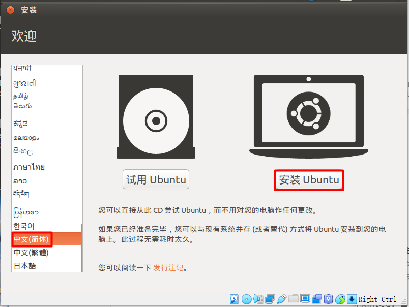

检查是否连接网络，是否安装第三方软件，然后点击“继续”：

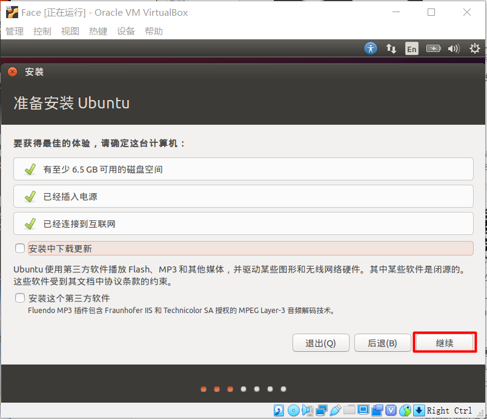

确认安装类型，选择”其他选项”，在点击继续：

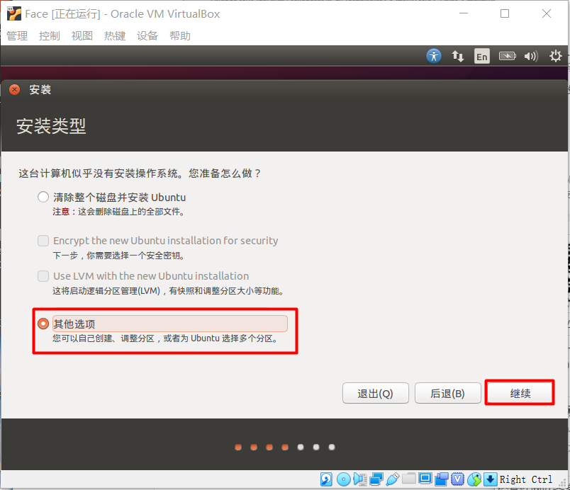

新建分区表，点击“新建分区表”按钮：

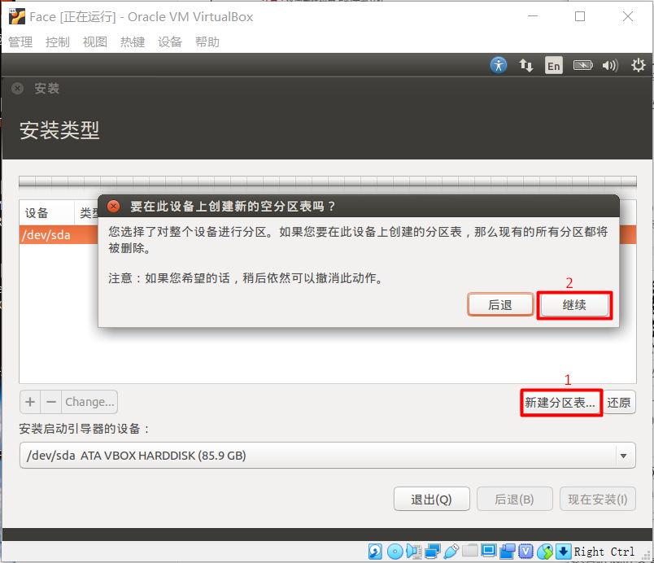

创建分区，添加交换空间和根目录：

交换空间和根目录的大小如何划分呢？一般来说，我们选择512MB到1G大小作为交换空间，剩下空间全部用来作为根目录。

交换空间：选择下图中“空闲”，然后再点击“+”按钮，用来创建交换空间：


大小：我们设置512MB。新分区的类型：选择“主分区”选项。新分区的位置：选择“空间起始位置”选项。用于：在下拉列表中选择“交换空间”选项，然后点击“确定”按钮：

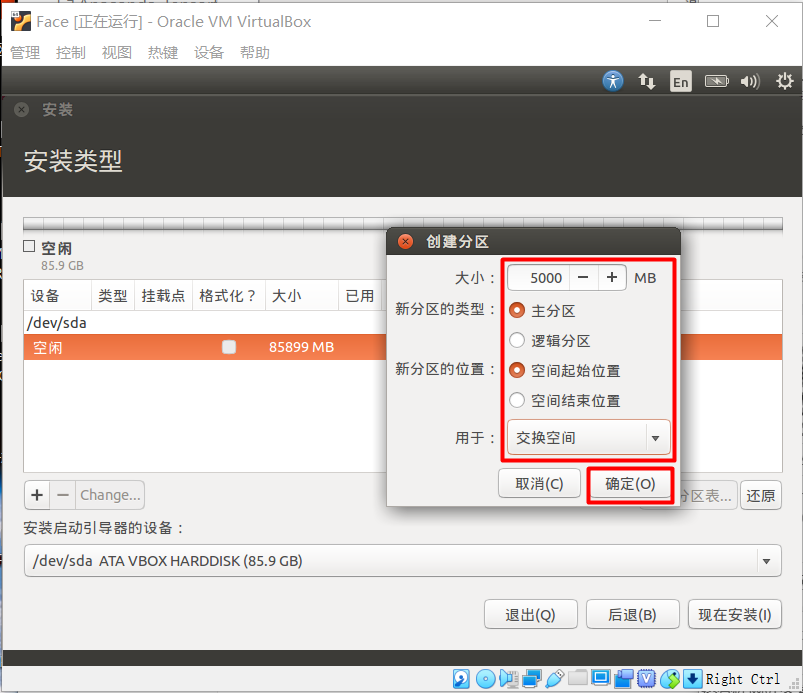

根目录：选择下图中“空闲”，然后再点击“+”按钮，用来创建根目录：

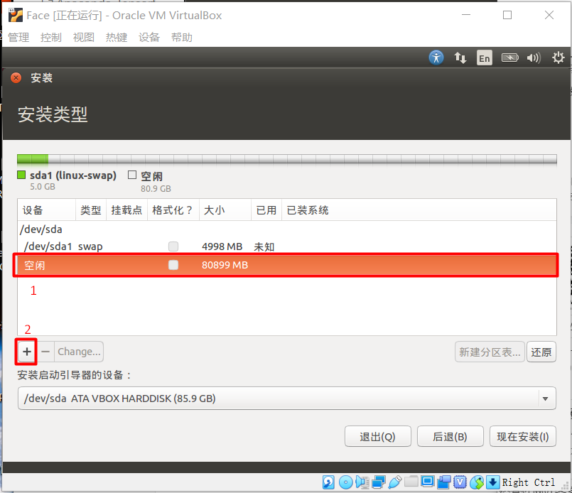

大小：不用改动，系统自动设为剩余的空间。新分区的类型：选择“逻辑分区”选项。新分区的位置：选择“空间起始位置”选项。用于：在下拉列表中选择“EXT4日志文件系统”选项。挂载点：在下拉列表中选择“/”选项：


开始安装，点击“现在安装”按钮：

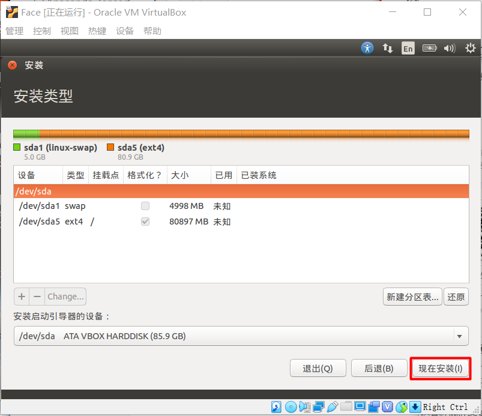

继续、继续：

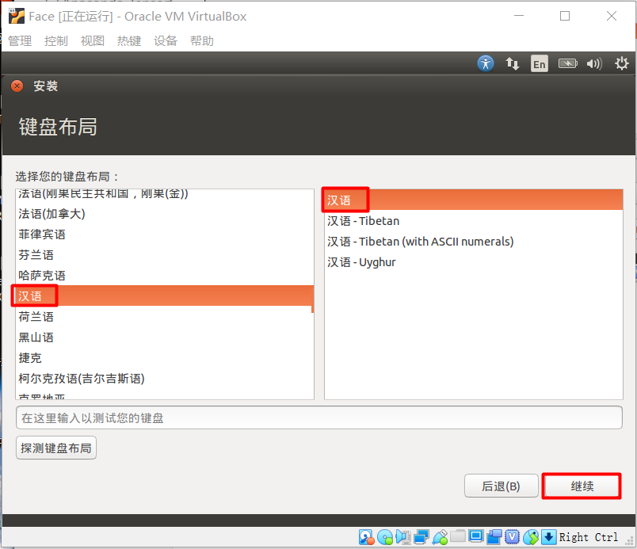

设置用户名和密码，建议选择“登录时需要密码”选项。由于我们现在处于学习阶段，不需要考虑安全问题，密码建议使用一位的密码，这样在安装软件需要输入密码的时候也比较方便：

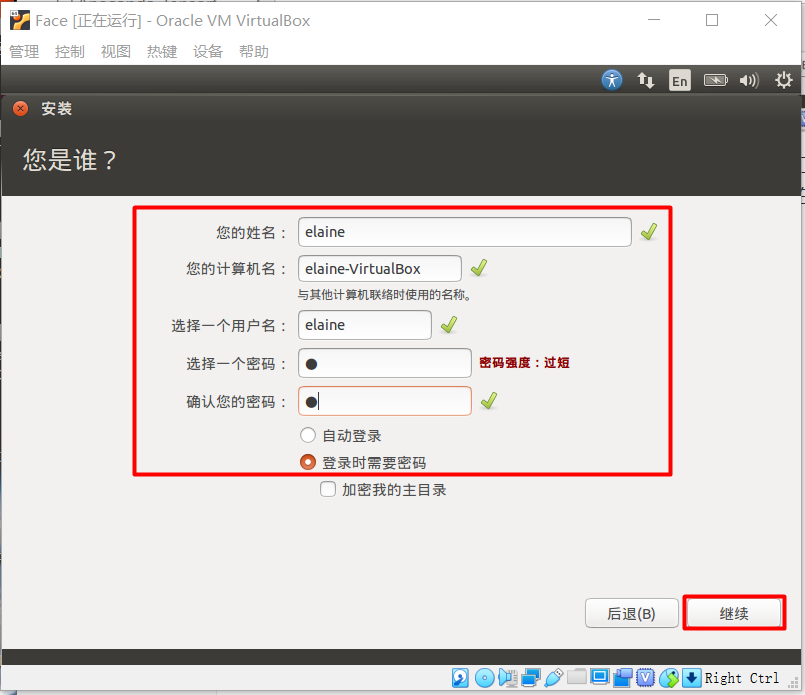

现在安装过程，系统会自动安装，不要点击skip，可以泡杯咖啡，等候系统自动安装完成。

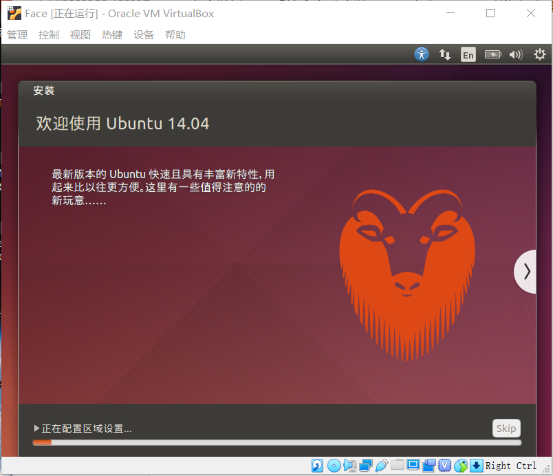

安装完成，重启。“现在重启”只是重启虚拟机系统的运行，并不是重启Windows系统：

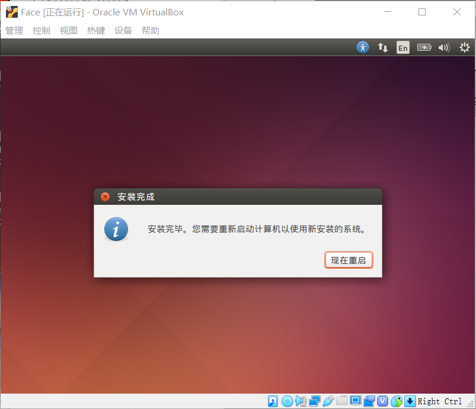

输入密码：

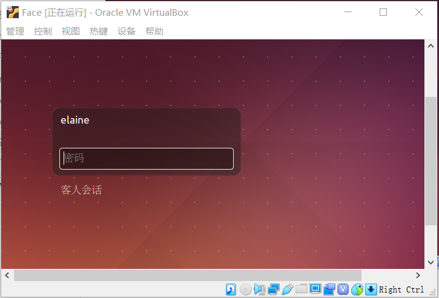

到此为止，在win10上用virtualBox虚拟机安装Ubuntu14.04的教程结束。

按照上述步骤安装完成以后，可能有部分人有无法连接网络的情况。不能联网的读者可以选择切换当前网络模式到桥接模式。可以联网的人请跳过此步骤。

### 4. 将win中的文件传给ubuntu <span id = "将win中的文件传给ubuntu">

**双向拷贝**

在VirtualBox里直接设置：

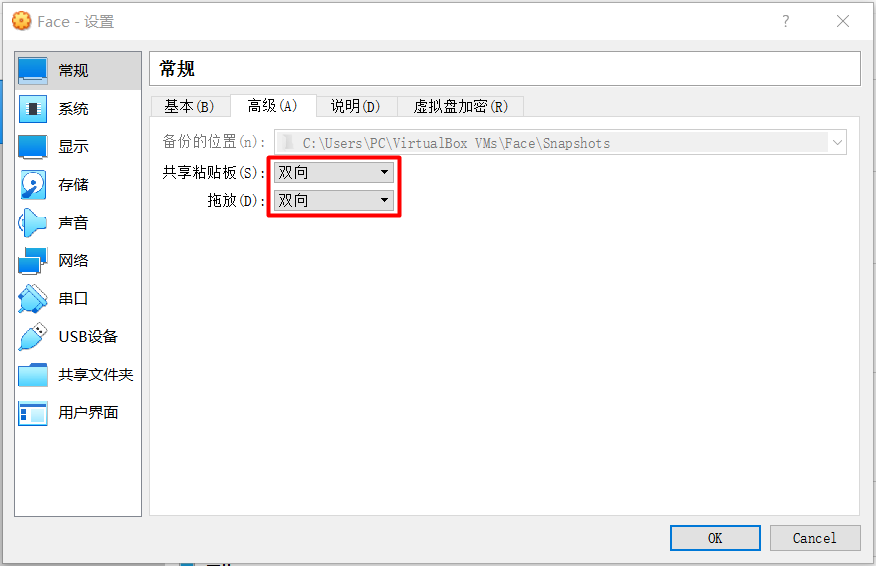

然后到ubuntu系统中设置“增强功能”：

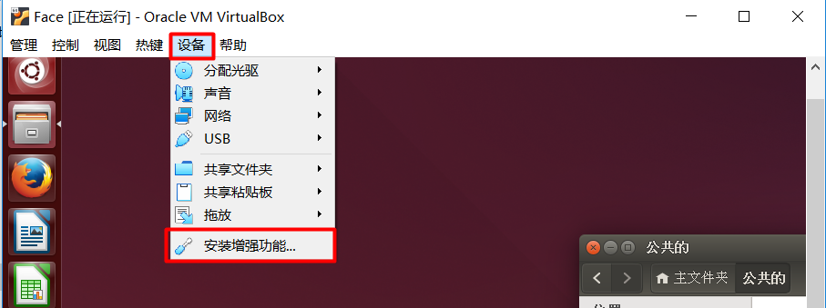

安装完增强功能，注意要**重启虚拟机**，双向拷贝才被启用。

**文件共享**

首先设置共享文件夹：

设置->共享文件夹->添加共享文件夹->勾选自动挂载和固定分配（有时候默认就是固定分配）->点击确定。

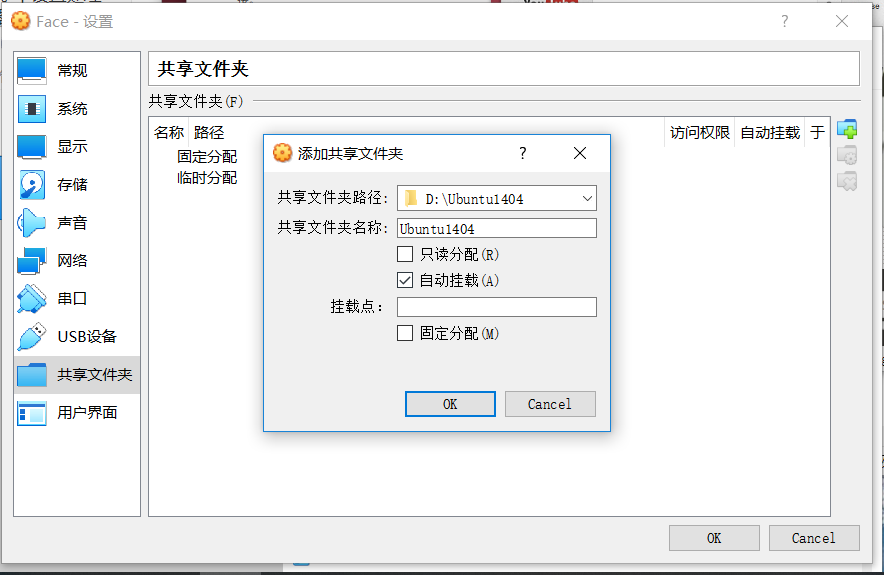

将刚刚指定的共享文件夹与Ubuntu的某个目录关联起来：

此处我选择在/mnt下创建一个“share”目录，将刚刚的“ubuntu1404”目录与“share”目录关联起来。

```
cd /mnt % 进入/mnt
sudo mkdir share % 创建share目录
sudo mount -t vboxsf ubuntu1404 /mnt/share % 将ubuntu1404目录与share目录进行关联
```

可能遇到的错误：

```
% 1. mount: unknown filesystem type ‘vboxsf’ centos ubuntu
% 此问题是由于ubuntu上没有安装Virtualbox的驱动造成的，执行以下两行命令安装后就可解决
sudo apt-get update
sudo apt-get install virtualbox-guest-utils
% 2. mounting failed with the error: No such device
% 此问题是由于ubuntu上没有安装增强功能导致的，点击设备->安装增强功能，安装后就可以解决
% 3. mounting failed with the error: Protocol error
% 此问题是由于windows中共享文件夹的名称与ubuntu中的名称相同导致的问题。比如ubuntu中文件夹的名称为share，如果共享文件夹的名字也是share的话，就会出现此错误。
```

如果你不想用cd打开，想用图形化界面打开文件夹：

```bash
gnome-open /mnt/share
% 可能遇到的问题：程序“gnome-open”尚未安装
% 解决方法：sudo apt-get install libgnome2-bin
```


