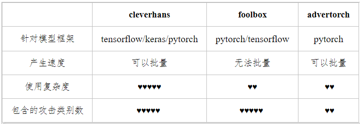

# 对抗攻击

## Content

- [对抗攻击概念](#对抗攻击概念)
- [对抗攻击分类](#对抗攻击分类)
- [对抗攻击实现工具](#对抗攻击实现工具)

### 对抗攻击概念

通过对输入添加微小的扰动使得分类器分类错误，一般对用于深度学习的网络的攻击算法最为常见，应用场景包括目前大热的CV和NLP方向，例如，通过对图片添加精心准备的扰动噪声使得分类器分错，或者通过对一个句子中的某些词进行同义词替换使得情感分类错误。

### 对抗攻击分类

##### (1) 从攻击环境来分：黑盒攻击、白盒攻击、灰盒攻击

- 黑盒攻击：攻击者对攻击的模型的内部结构，训练参数，防御方法（如果加入了防御手段的话）等等一无所知，只能通过输出输出与模型进行交互。
- 白盒攻击：与黑盒模型相反，攻击者对模型一切都可以掌握。目前大多数攻击算法都是白盒攻击。
- 灰盒攻击：介于黑盒攻击和白盒攻击之间，仅仅了解模型的一部分。（例如仅仅拿到模型的输出概率，或者只知道模型结构，但不知道参数）

##### (2) 从攻击的目的来分：有目标攻击、无目标攻击

- 无目标攻击：以图片分类为例，攻击者只需要让目标模型对样本分类错误即可，但并不指定分类错成哪一类。
-  有目标攻击：攻击者指定某一类，使得目标模型不仅对样本分类错误并且需要错成指定的类别。从难度上来说，有目标攻击的实现要难于无目标攻击。

##### (3) 从扰动的强度大小来分：无穷范数攻击、二范数攻击、0范数攻击

- 无穷范数攻击，当p趋近于无穷大时，上式子表示扰动中最大的一个，通常在论文里，对于MNIST数据集，限制是（-0.3，0.3）
- 二范数攻击，即p=2
- 0范数攻击（单像素攻击）此时限制的是可以改变的像素个数，不关心具体每个像素值改变了多少。在MNIST数据集中，一般限制是12个。

##### (4) 从攻击的实现来分：基于梯度的攻击、基于优化的攻击、基于决策面的攻击或者其他

- 基于梯度的攻击：
  - FGSM（Fast Gradient Sign Method)　　
  - PGD（Project Gradient Descent）
  - MIM（Momentum Iterative Method）
- 基于优化的攻击：CW（Carlini-Wagner Attack）
- 基于决策面的攻击：DEEPFOOL
- 其他：Pointwise

### 对抗攻击实现工具

