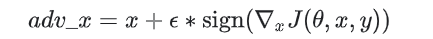

# FGSM（Fast Gradient Sign Method）

快速梯度符号方法通过使用神经网络的梯度来创建对抗性示例。对于输入图像，该方法使用损失相对于输入图像的梯度来创建使损失最大化的新图像。该新图像称为对抗图像。可以使用以下表达式来总结：

- adv_x：对抗图像。
- x：原始输入图像。
- y：原始输入标签。
- ϵ
- θ
- J

一种实现此目的的方法是找出图像中的每个像素对损耗值的贡献程度，并相应地增加扰动。由于不再对模型进行训练（因此，相对于可训练变量（即模型参数）不采用梯度），因此模型参数保持恒定。唯一的目标是欺骗已经受过训练的模型。

